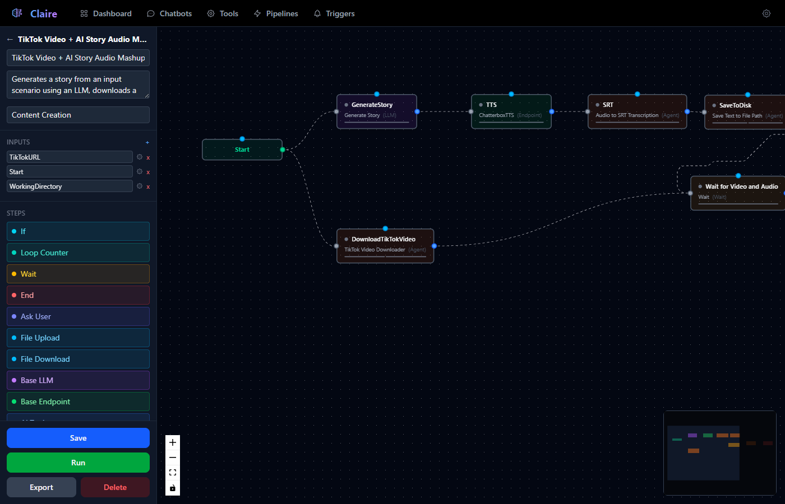
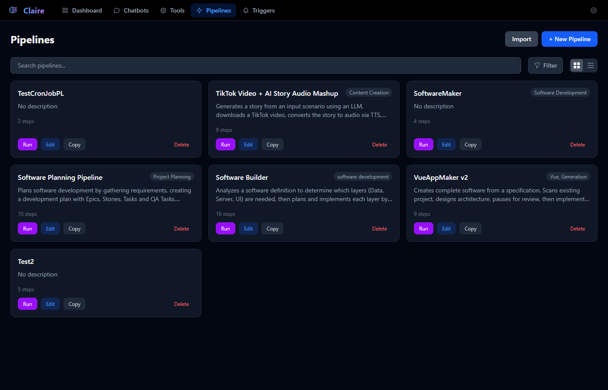
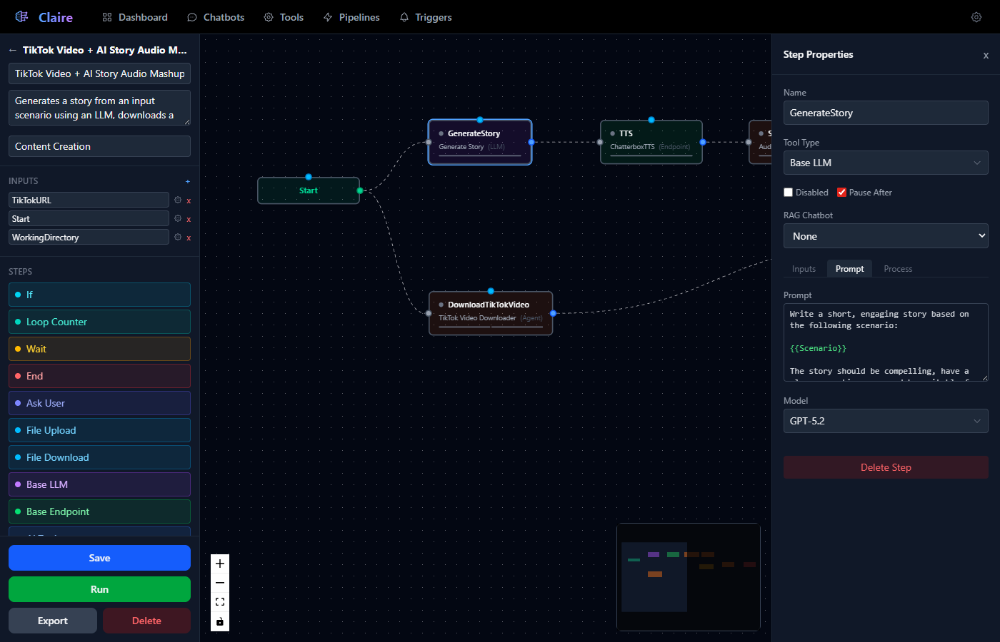
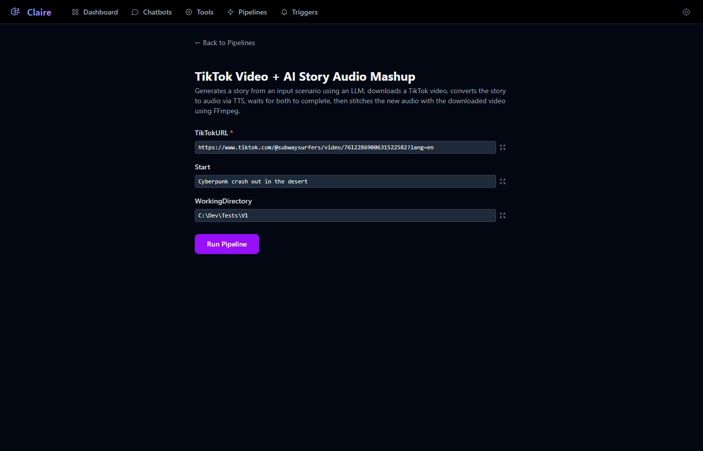
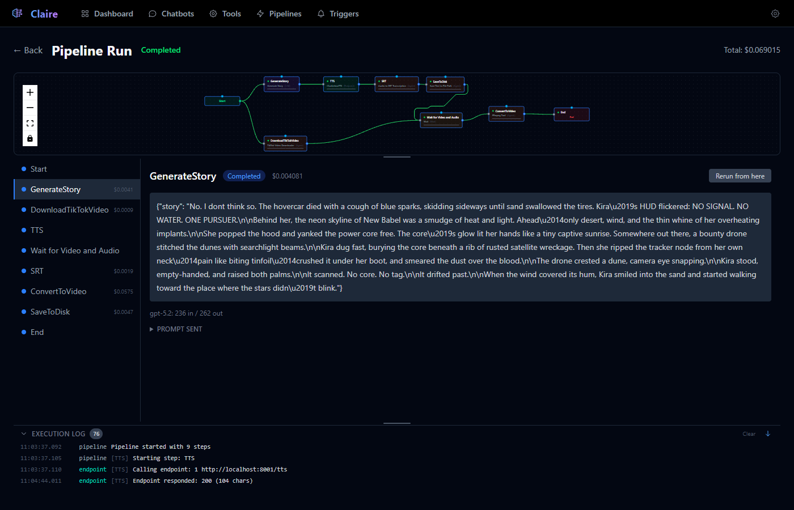

# Pipelines

Pipelines are visual, multi-step workflows that chain [Tools](../Tools/Tools.md) together into directed graphs. Each step executes a tool — an LLM call, an API request, an autonomous agent, a conditional branch, or a user interaction — and passes its output to the next step via template variables. Pipelines support parallel execution, conditional branching, looping, pause/resume, memory persistence, and interactive user prompts.



---

## Pipelines List

The Pipelines page (`/pipelines`) displays all available pipelines with two view modes:

- **List view** — Compact rows showing name, description, tags, step count, and action buttons.
- **Grid view** — Card layout with the same information in a visual grid.




### Features

| Feature | Description |
|---|---|
| **Search** | Filter pipelines by name, description, or tag. |
| **Tag Filter** | Multi-select dropdown to filter by specific tags. |
| **Drag-and-drop** | Reorder pipelines by dragging — order is persisted. |
| **Import** | Upload a `.json` pipeline export file to create a new pipeline. IDs are automatically remapped to avoid collisions. |
| **+ New Pipeline** | Create a blank pipeline and open the editor. |

Each pipeline in the list shows action buttons:

- **Run** (purple) — Opens the Pipeline Runner to provide inputs and start execution.
- **Edit** (blue) — Opens the Pipeline Editor.
- **Copy** (gray) — Duplicates the pipeline with a new ID.
- **Delete** (red) — Removes the pipeline and all its runs (with confirmation).

---

## Pipeline Editor

The Pipeline Editor (`/pipeline/{id}`) is a three-panel layout: a left sidebar for settings and the step palette, a central canvas for the visual graph, and a right properties panel for configuring the selected step.

### Left Panel — Settings & Step Palette

#### Pipeline Settings

| Field | Description |
|---|---|
| **Name** | Display name shown in the list, runner, and run viewer. |
| **Description** | Free-text description shown in the list and runner page. |
| **Tag** | Comma-separated tags for filtering and organization. |

#### Pipeline Inputs

Pipeline inputs define the parameters that are prompted for when the pipeline is run. Click **+ Add** to create a new input. Each input has:

- **Name** — The variable name, referenced as `{{Name}}` in step prompts.
- **Gear icon** — Opens the Input Config modal to set type, required flag, and options.
- **X button** — Removes the input.

Supported input types: Text, Number, Boolean, Date, Password, Select (dropdown with predefined options).

#### Steps Palette

The steps palette contains draggable node types, color-coded by category. Drag any item onto the canvas to add it as a step:

| Step | Color | Description |
|---|---|---|
| **If** | Cyan | AI-powered conditional branching. |
| **Loop Counter** | Teal | Loop control with configurable max passes. |
| **Wait** | Amber | Synchronization barrier for parallel branches. |
| **End** | Red | Terminal step — marks the end of a branch. |
| **Ask User** | Indigo | Pauses to ask the user questions, then resumes. |
| **File Upload** | Sky | Pauses to request files from the user. |
| **File Download** | Sky | Downloads a URL or copies a file for the user. |
| **Base LLM** | Purple | Inline LLM step (no saved tool — prompt configured directly). |
| **Base Endpoint** | Green | Inline HTTP endpoint step (no saved tool). |
| **AI Tool** | Blue | Inline agent step (no saved tool). |

Below the step palette, you can also drag **Memory** nodes onto the canvas:

| Memory Type | Color | Description |
|---|---|---|
| **Short Term Memory** | Sky (dashed) | Conversation context that exists only during a single pipeline run. |
| **Long Term Memory** | Amber (dashed) | Persistent conversation context that survives across runs. |

In addition to the palette items, the **Tool Type** dropdown in the step properties panel lets you assign any saved tool (from the Tools page) to a step. This allows you to reuse pre-built LLM, Endpoint, or Agent tools inside a pipeline.

#### Recent Runs

A collapsible section at the bottom shows the last 10 runs for this pipeline with status indicators and timestamps. Click a run to navigate to its run viewer.

#### Action Buttons

| Button | Description |
|---|---|
| **Save** | Persists the pipeline definition (steps, edges, inputs, positions). |
| **Run** | Opens a modal to provide input values, then starts execution. |
| **Export** | Downloads the pipeline as a `.json` file for backup or sharing. |
| **Delete** | Permanently removes the pipeline and all associated runs. |

---

### Center Panel — Visual Canvas

The canvas uses [Vue Flow](https://vueflow.dev/) to render the pipeline as an interactive directed graph.


#### Nodes

Each step appears as a node on the canvas. Nodes display:

- **Status dot** — Color-coded indicator (gray = pending, blue = running, green = completed, red = failed, yellow = paused, indigo = waiting for input).
- **Step name** — The display name.
- **Tool name and type** — The assigned tool and its type badge (LLM, Endpoint, Agent, etc.).
- **Connection handles** — Ports for drawing edges between nodes.

**Handle layout varies by step type:**

| Step Type | Handles |
|---|---|
| **Start** | Output (right, emerald). |
| **End** | Input (left) only — no output. |
| **If** | Input (left), True output (green, upper-right), False output (red, mid-right), After output (bottom, gray). |
| **All others** | Input (left), Output (right, blue), Memory (top, sky). |

**Special node types:**

- **Inputs Node** — An emerald-bordered node that represents the pipeline's input parameters. It is always present and shows the names and types of all configured inputs.
- **Memory Node** — A dashed-bordered node (amber for long-term, sky for short-term) that represents a memory store. Connect steps to memory nodes by drawing edges from the step's top handle to the memory node.

#### Edges

Draw connections by clicking and dragging from one handle to another. Edges define execution flow:

- **Normal edges** (from output handle to input handle) — Define `next_steps` for sequential flow.
- **If edges** (from true/false handles) — Define `next_steps_true` and `next_steps_false` for conditional branching.
- **Memory edges** (from step's top handle to memory node) — Connect a step to a memory store. These appear as dashed sky-blue lines.

Click an edge to select it, then press Delete to remove it.

#### Canvas Controls

- **Pan** — Click and drag on the background.
- **Zoom** — Mouse wheel or +/- buttons.
- **Fit view** — Center button to fit all nodes in the viewport.
- **Lock** — Lock button to prevent accidental node movement.
- **MiniMap** — Overview thumbnail in the bottom-right corner, color-coded by node type.

---

### Right Panel — Step Properties

Click any step node on the canvas to open the Step Properties panel on the right side.



#### Common Properties (all step types)

| Field | Description |
|---|---|
| **Name** | The step's display name. |
| **Tool Type** | Dropdown to assign a saved tool or built-in type (Base LLM, Base Endpoint, If, etc.). Changing this reconfigures the step. |
| **Disabled** | Checkbox — if checked, the step is skipped during execution and input passes through to the next step. |
| **Pause After** | Checkbox — if checked, the pipeline pauses after this step completes, allowing you to review output before continuing. |

#### Tabs

The properties panel organizes step configuration into tabs. The available tabs depend on the step type:

| Tab | Available For | Contents |
|---|---|---|
| **Inputs** | All | Input field mappings with template variable support. |
| **Prompt** | LLM, Agent, If, Ask User | System prompt, user prompt, and model selection. |
| **Endpoint** | Endpoint | URL, method, headers, query params, body, and timeout. |
| **Structure** | LLM, Endpoint, Agent | Response structure editor for forced structured output (JSON schema). |
| **Process** | All except If | Pre-process and post-process JavaScript code editors. |

#### Inputs Tab

Shows the step's input fields. Each input can be mapped to a template variable:

- **Name** — The input variable name.
- **Value** — A text field with template variable support. Type `{{` to trigger autocomplete listing available variables from pipeline inputs and previous step outputs.
- **Gear icon** — Opens the Input Config modal to set type, required flag, and options.

Template variables in input values are highlighted: green for valid references, red for unrecognized ones.

#### Prompt Tab (LLM / Agent / If / Ask User)

- **System Prompt** — Instructions for the LLM's behavior (Agent, If, and Ask User types).
- **Prompt** — The user message template, typically containing `{{Variable}}` references. This is the main instruction sent to the model.
- **Model** — Dropdown to select which LLM model to use for this step.

#### Endpoint Tab (Endpoint only)

| Field | Description |
|---|---|
| **Method** | HTTP method: GET, POST, PUT, or DELETE. |
| **URL** | The endpoint URL, with template variable support. |
| **Query Params** | Key-value editor for URL query parameters. |
| **Headers** | Key-value editor for HTTP headers. |
| **Body** | Key-value editor for request body (POST/PUT only). |
| **Timeout** | Request timeout in seconds (default 60). |

All fields support template variables — use `{{StepName}}` or `{{Input}}` to inject dynamic values.

#### Structure Tab (LLM / Endpoint / Agent)

Define the expected output structure as a set of typed fields. When a response structure is defined:

1. The LLM is forced to return structured JSON matching your schema via tool use.
2. Step outputs can be accessed using dot-notation in downstream steps: `{{StepName.fieldName}}`.

The structure editor supports nested objects. Each field has a name, type (string, number, boolean, object), and optional children for object types.

#### Process Tab

Two JavaScript code editors for transforming data:

- **Pre-Process** — Runs before the step executes. Receives the input string as a parameter. If it returns a list, the step executes once per item (input splitting).
- **Post-Process** — Runs after the step completes. Receives the output string and can transform it before passing to the next step.

```javascript
// Pre-process example: split a comma-separated list into individual items
function process(input) {
  return input.split(',').map(s => s.trim()).filter(s => s);
}

// Post-process example: extract JSON from a markdown code fence
function process(output) {
  const match = output.match(/```json\n([\s\S]*?)\n```/);
  return match ? match[1] : output;
}
```

When pre-process returns a list, the step runs once per item. All iteration outputs are concatenated into the final output. The run viewer shows each iteration separately.

#### Retry Settings

Available for LLM, Endpoint, and Agent steps:

| Field | Description |
|---|---|
| **Retry** | Toggle to enable automatic retry on failure. |
| **Max Retries** | Number of retry attempts (1–10). Uses exponential backoff (2s, 4s, 6s, ...). |

#### Delete Step

A red **Delete Step** button at the bottom removes the step from the pipeline (not available for Start steps).

---

### AI Assist

Click the **AI Assist** button in the left panel to open a dialog where you can describe a pipeline in natural language. Select a model, type your description, and click Generate. The AI will produce a pipeline configuration that you can review and apply.

Example description:
> "Create a pipeline that takes a topic, generates a blog post outline, then writes each section in parallel, and finally combines them into a full article."

Click **Apply to Pipeline** to replace the current pipeline's steps and edges with the generated configuration.

---

## Step Types Reference

### Start

The entry point of every pipeline. Automatically created when a pipeline is first built. It collects the pipeline's input values and passes them as outputs to connected steps.

- **Outputs:** Each pipeline input becomes a named output (e.g., if the pipeline has an input "Topic", the Start step outputs `{{Topic}}`).
- **Connections:** Connect the Start node's output handle to the first processing step(s).

### LLM

Sends a prompt to an AI model (Claude, GPT, Gemini, or Grok) and returns the text response.

- **System Prompt** — Defines the model's role and behavior.
- **Prompt** — The user message, typically containing `{{Variable}}` references to inject data from previous steps.
- **Model** — Which model to use (defaults to the pipeline's configured default).
- **Structured Output** — Optionally define a response structure to force JSON output.
- **Memory** — Connect to a memory node to maintain conversation context across iterations or runs.

### Endpoint

Makes an HTTP request to an external API and returns the response.

- **Method** — GET, POST, PUT, or DELETE.
- **URL** — The endpoint URL with template variable support.
- **Headers** — Key-value pairs for request headers (supports template variables).
- **Query Params** — Key-value pairs appended to the URL.
- **Body** — Key-value pairs for the request body (POST/PUT only, supports template variables).
- **Timeout** — Request timeout in seconds.

### Agent

Runs an autonomous agent loop where the LLM can call Python functions and MCP server tools iteratively. See the [Tools documentation](../Tools/Tools.md#agent-execution-details) for full details on agent execution.

When used in a pipeline:
- The agent's final tool result (or text response if no tools were called) becomes the step's output for downstream chaining.
- If a response structure is defined, the agent's output is post-processed through an additional LLM call to extract structured data.

### If (Conditional)

AI-powered conditional branching. The LLM evaluates a condition and routes execution to the true or false path.

- **Prompt** — The condition to evaluate. Use template variables to inject data (e.g., `"Does {{PreviousStep}} contain any errors?"`).
- **System Prompt** — Additional context for the evaluator.
- **Model** — Which model evaluates the condition.

The If node has three output handles:
- **True** (green) — Followed when the condition is true.
- **False** (red) — Followed when the condition is false.
- **After** (gray) — Always followed regardless of the result (for common continuation logic).

The LLM returns a boolean result and its reasoning, which is displayed as the step's status text in the run viewer.

### Loop Counter

Controls loop execution by counting passes and halting after a maximum number of iterations.

- **Max Passes** — The maximum number of times this step can execute before halting the branch.

**How looping works:**
1. Connect the output of a downstream step back to the Loop Counter's input to create a cycle.
2. Each time the Loop Counter executes, it increments its counter.
3. When the counter exceeds Max Passes, it halts — downstream steps in the loop are not executed.
4. When the counter has not exceeded Max Passes, all downstream steps are reset to Pending and re-execute on the next pass.

The Loop Counter's output passes the input through unchanged.

### Wait

A synchronization barrier for parallel branches. The Wait step does not execute until all incoming branches have completed.

- Connect multiple steps' outputs to a single Wait step's input.
- The Wait step counts incoming branches and waits for all to reach Completed (or Failed) status.
- Once all branches arrive, execution continues from the Wait step.

Use Wait to converge parallel branches before a step that needs results from all of them.

### End

Marks the end of a pipeline branch. The End step passes its input through as output and has no outgoing connections. A pipeline can have multiple End steps for different branches.

### Ask User

An interactive step that pauses execution to ask the user questions, then feeds the answers back to the LLM.

**Execution flow:**
1. The LLM receives the prompt (with resolved template variables) and any connected memory context.
2. The LLM decides whether it has enough information or needs to ask questions. It responds with either:
   - `status: "ready"` — It has enough information and provides a summary as output.
   - `status: "questions"` — It generates a list of questions, each with an ID, text, and type (text input or multiple choice).
3. If questions are generated, the pipeline pauses and the run viewer displays the questions to the user.
4. The user answers the questions and clicks Submit.
5. The answers are fed back to the LLM, which may ask follow-up questions or declare itself ready.
6. This loop continues for up to 10 rounds or until the LLM is satisfied.

**Question types:**
- **Text** — Free-form text input.
- **Choice** — Multiple choice with predefined options (radio buttons).

The step's final output is the LLM's summary text once it declares `status: "ready"`.

### File Upload

Pauses execution to request file uploads from the user.

- **Upload Message** — The prompt shown to the user (e.g., "Upload the documents to process").

**Execution flow:**
1. The run viewer displays a drag-and-drop file upload zone with the configured message.
2. The user selects and uploads files.
3. The files are saved to the run's upload directory.
4. The step's output is a JSON array of absolute file paths: `["/path/to/file1.pdf", "/path/to/file2.pdf"]`.

Downstream steps can use these file paths as input for processing.

### File Download

Downloads a file from a URL or copies a local file, making it available for download from the run viewer.

- **Filename** — The desired output filename (supports template variables).

**Input handling:**
- If the input is a URL (http/https): downloads the file.
- If the input is a file path: copies the file.
- If the input is raw text: writes it to a file.

The step's output is a JSON object with download metadata: `{url, filename, size}`.

---

## Pipeline Runner

The Pipeline Runner (`/pipeline-runner/{id}`) provides a simple form for starting a pipeline execution.



1. The runner shows the pipeline's name and description.
2. Input fields are rendered dynamically based on the pipeline's configured inputs (text fields, dropdowns, checkboxes, etc.). Required fields are marked with a red asterisk.
3. Click **Run Pipeline** to start execution.
4. You are redirected to the Pipeline Run viewer to see real-time progress and results.

---

## Pipeline Run Viewer

The Pipeline Run viewer (`/pipeline-run/{id}`) shows the live execution of a pipeline with three resizable panels: the flow graph, the step detail area, and the execution log.



### Top Bar

- **Back** — Returns to the pipelines list.
- **Pipeline Run** — Title with the run's status badge.
- **Total cost** — Aggregate cost across all steps (e.g., `$0.069015`).
- **Stop** (red) — Force-stop a running pipeline.
- **Resume** (green) — Resume a paused pipeline.

### Flow Graph Panel

A read-only Vue Flow view of the pipeline graph showing real-time execution status:

- **Node colors** update as steps execute: gray (pending), blue (running), green (completed), red (failed).
- **Edge colors** show the execution path: green for traversed edges, gray for unvisited, red for failed branches.
- The graph is interactive (pan/zoom) but not editable.

### Step List & Detail Panel

**Left sidebar** shows all steps with:
- **Status dot** — Color-coded by execution state.
- **Step name** — Click to select and view details.
- **Cost** — Per-step cost displayed next to the name.

**Main content area** shows the selected step's details:

#### Step Output
- The step's output text, rendered as markdown.
- For agent steps, both the **Agent Response** (LLM text) and **Tool Result** (last function return value) are shown in expandable sections.
- **Token breakdown** — Input/output token counts and model name.
- **Prompt Sent** — Expandable section showing the exact system prompt and user prompt that were sent to the model.

#### Step Controls
- **Rerun from here** (blue) — Creates a new run starting from this step, preserving outputs from previous steps.
- **Edit Output** (yellow, paused runs only) — Opens a text editor to modify the step's output before resuming.

#### Split Iterations
When a step's pre-process returns a list, the step runs once per item. The run viewer shows:
- A button grid with iteration numbers.
- Click an iteration to view its individual input, output, and cost.
- Active iterations show a pulsing indicator; completed ones show a checkmark.

#### Ask User Interaction
When an Ask User step is waiting for input, the detail area shows:
- A "Clarification Needed" badge with the round number.
- Each question with its text and input type (text field or radio buttons for choices).
- A **Submit Answers** button to send responses and continue execution.

#### File Upload Interaction
When a File Upload step is waiting:
- A drag-and-drop zone appears for file selection.
- Selected files are listed with their sizes.
- Click **Upload & Continue** to upload files and resume execution.

### Execution Log Panel

A collapsible log viewer at the bottom showing timestamped execution events:

- **Timestamp** — `HH:MM:SS.mmm` format.
- **Source** — Color-coded category: pipeline (gray), llm (purple), agent (orange), endpoint (green), condition (cyan).
- **Step name** — In brackets, showing which step generated the log entry.
- **Message** — The log message text.

The log auto-scrolls as new entries arrive. A toggle button controls auto-scroll behavior. Maximum 500 entries are displayed (oldest entries are pruned).

---

## Memory

Memory nodes allow steps to maintain conversation context — either within a single run (short-term) or across multiple runs (long-term).

### How Memory Works

1. **Create a memory node** — Drag a Short Term or Long Term memory from the palette onto the canvas.
2. **Connect steps** — Draw an edge from a step's top (memory) handle to the memory node.
3. **During execution** — Connected steps inject stored memory messages before their prompt, and append their input/output to the memory after execution.

### Memory Types

| Type | Persistence | Use Case |
|---|---|---|
| **Short Term** | Within a single pipeline run only. | Multi-step conversation context within one execution. |
| **Long Term** | Persisted to database across runs. | Accumulated knowledge that builds over time. |

### Memory Properties

When you select a memory node on the canvas, the right panel shows:

| Field | Description |
|---|---|
| **Name** | Display name for the memory node. |
| **Type** | Short Term or Long Term (set at creation, not editable). |
| **Max Messages** | Limit the number of stored messages (0 = unlimited). When exceeded, oldest messages are pruned. |

- **View Memory** — Opens a modal showing all stored messages with role (user/assistant), step name, timestamp, and content.
- **Clear Memory** — Deletes all stored messages (useful for resetting long-term memory).
- **Delete Memory Node** — Removes the memory node from the pipeline.

### Memory Message Format

Each memory entry stores:
- **Role** — `user` (step input) or `assistant` (step output).
- **Content** — The text content.
- **Step Name** — Which step appended this message.
- **Timestamp** — When the message was appended.

Memory messages are injected at the beginning of the LLM message list, providing prior context before the current prompt.

---

## Template Variables

Template variables allow dynamic content throughout the pipeline using `{{variableName}}` syntax.

### Syntax

| Syntax | Description |
|---|---|
| `{{Input}}` | References a pipeline input or step input named "Input". |
| `{{StepName}}` | References the output of a completed step by its name. |
| `{{StepName.field}}` | Dot-notation access for structured output fields. |
| `{{Items[0]}}` | Array index access for the first element. |
| `{{Items[-1]}}` | Negative index — relative to the current position. |
| `{{Items[@]}}` | Auto-indexed — resolves to the current iteration index (during input splitting). |

### Resolution Order

When a step executes, template variables are resolved in this priority order:

1. **Step inputs** — Values explicitly mapped in the step's Inputs tab.
2. **Previous step outputs** — Outputs from completed upstream steps, referenced by step name.
3. **Pipeline inputs** — User-provided values from the run's input form.
4. **Accumulated outputs** — All outputs from all completed steps in the run.

If a step has a default input (named "Input") that remains empty after resolution, it automatically inherits the output from the most recently completed upstream step.

### Autocomplete

In the pipeline editor, typing `{{` in any template-enabled field triggers an autocomplete dropdown listing all available variable names — pipeline inputs, step names, and input field names. Valid references are highlighted green; unrecognized ones are highlighted red.

---

## Pause & Resume

Pipelines can be paused at any step for manual review before continuing.

### Pausing

- **Pause After** checkbox — Enable on any step in the editor. When that step completes, the pipeline pauses.
- **Ask User / File Upload** — These steps automatically pause the pipeline while waiting for user input.
- **Manual stop** — Click the Stop button in the run viewer to halt execution.

### Resuming

1. When a pipeline is paused, the run viewer shows a green **Resume** button in the top bar.
2. Before resuming, you can optionally **Edit Output** on any completed step to modify its value. This changes what downstream steps receive.
3. Click **Resume** to continue execution from where it left off.

---

## Rerun from Step

You can re-execute a pipeline starting from any specific step:

1. In the run viewer, select a completed step.
2. Click **Rerun from here** (blue button).
3. A new pipeline run is created:
   - Steps before the selected step retain their outputs from the original run.
   - The selected step and all downstream steps are reset to Pending and re-execute.
4. You are navigated to the new run's viewer.

This is useful for iterating on a specific step without re-running the entire pipeline.

---

## Parallel Execution

Pipelines support parallel step execution. When a step has multiple outgoing edges, the downstream steps execute concurrently (up to 5 concurrent steps).

### Creating Parallel Branches

1. Connect one step's output to multiple downstream steps.
2. All connected steps start executing simultaneously when the upstream step completes.

### Converging Parallel Branches

Use a **Wait** step to synchronize:

1. Connect all parallel branch outputs to a single Wait step.
2. The Wait step holds until all incoming branches complete.
3. Execution continues from the Wait step with access to all branch outputs.

---

## Concurrency & Limits

| Limit | Value |
|---|---|
| Max concurrent steps | 5 |
| LLM step timeout | Model default |
| Endpoint step timeout | Configurable (default 60s) |
| Agent function timeout | 15 minutes |
| Agent max iterations | 30 |
| Agent token budget | 500,000 tokens |
| Ask User response timeout | 1 hour |
| File Upload response timeout | 1 hour |
| Ask User max rounds | 10 |

---

## Cost Tracking

Every LLM call within a pipeline tracks token usage and cost:

- **Per-step cost** — Displayed next to the step name in the run viewer sidebar.
- **Per-iteration cost** — When a step splits into multiple iterations, each iteration's cost is tracked separately.
- **Total run cost** — Aggregated across all steps, displayed in the run viewer's top bar.
- **Token breakdown** — Input and output token counts shown per model in the step detail area.

Cost is calculated using the model's configured pricing (per million tokens for input and output).

---

## Import & Export

### Exporting a Pipeline

1. Open the pipeline in the editor.
2. Click **Export** at the bottom of the left panel.
3. A `.json` file is downloaded containing the full pipeline definition (steps, edges, inputs, positions).

### Importing a Pipeline

1. On the Pipelines list page, click **Import**.
2. Select a `.json` file previously exported from Claire.
3. The pipeline is created with new unique IDs (all step IDs and edge references are remapped to prevent collisions).
4. Only files with `_export_type: "pipeline"` are accepted.
5. You are navigated to the editor for the new pipeline.

---

## Execution Details

### How a Pipeline Runs

1. **Start** — The Start step collects pipeline inputs and passes them as named outputs.
2. **Queue** — The next steps are queued based on edge connections.
3. **Execute** — Each step is executed according to its type:
   - Templates are resolved using available variables.
   - Pre-process JavaScript runs (if configured), potentially splitting the input into multiple iterations.
   - The step's tool executes (LLM call, HTTP request, agent loop, etc.).
   - Post-process JavaScript runs (if configured), transforming the output.
   - Memory is updated (if connected to a memory node).
4. **Route** — Based on the step's output and type:
   - Normal steps queue their `next_steps`.
   - If steps queue `next_steps_true` or `next_steps_false` based on the condition result.
   - Loop Counter steps either queue `next_steps` (continuing the loop) or halt the branch.
5. **Repeat** — Steps continue executing until no more are queued, a stop command is issued, or an unrecoverable error occurs.
6. **Complete** — All step outputs are collected, long-term memories are persisted, logs are flushed to the database, and the run status is set to Completed (or Failed).

### Event System

The run viewer receives real-time updates via Server-Sent Events (SSE):

| Event | Description |
|---|---|
| `step_start` | A step has begun executing. |
| `step_stream` | Streaming text chunk from an LLM call. |
| `step_split` | Pre-process returned a list — step will iterate. |
| `iteration_start` | An iteration has begun. |
| `iteration_complete` | An iteration has finished. |
| `step_complete` | A step has finished — includes output and cost. |
| `step_retry` | A step failed and is being retried. |
| `step_error` | A step has failed permanently. |
| `ask_user` | An Ask User step needs answers. |
| `file_upload_request` | A File Upload step is waiting for files. |
| `memory_update` | A memory node has been updated. |
| `pipeline_paused` | The pipeline has paused. |
| `pipeline_complete` | The pipeline has finished. |

The run viewer also polls the server every 2 seconds to ensure state consistency.

---

## Example: Building a Pipeline

Here is a walkthrough for building a simple content generation pipeline:

1. **Create** — Click **+ New Pipeline** on the Pipelines list page.
2. **Add inputs** — In the left panel, add two pipeline inputs: "Topic" (Text, required) and "Tone" (Select with options: Professional, Casual, Humorous).
3. **Add steps** — Drag a **Base LLM** step onto the canvas. Name it "GenerateOutline". Set the prompt to:
   ```
   Create a detailed blog post outline about {{Topic}} in a {{Tone}} tone.
   Return the outline as a numbered list of sections.
   ```
4. **Add another step** — Drag another **Base LLM** step. Name it "WriteArticle". Set the prompt to:
   ```
   Using this outline:
   {{GenerateOutline}}

   Write a complete blog post about {{Topic}} in a {{Tone}} tone.
   ```
5. **Connect** — Draw an edge from Start to GenerateOutline, then from GenerateOutline to WriteArticle, then from WriteArticle to an End step.
6. **Save** — Click Save to persist the pipeline.
7. **Run** — Click Run, enter "Artificial Intelligence" for Topic, select "Professional" for Tone, and click Run Pipeline.
8. **Watch** — The run viewer shows each step executing in real time with streaming output, costs, and execution logs.
