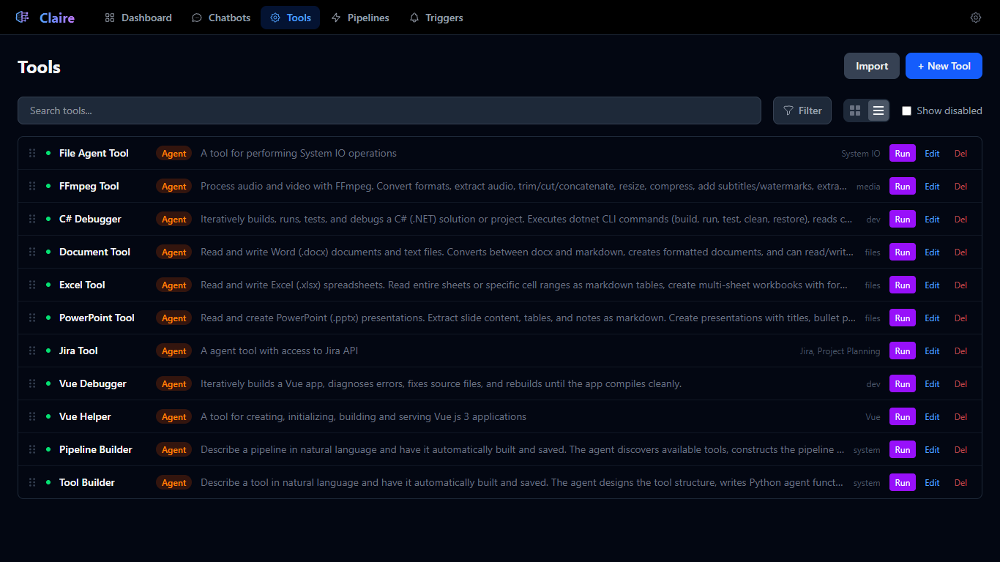
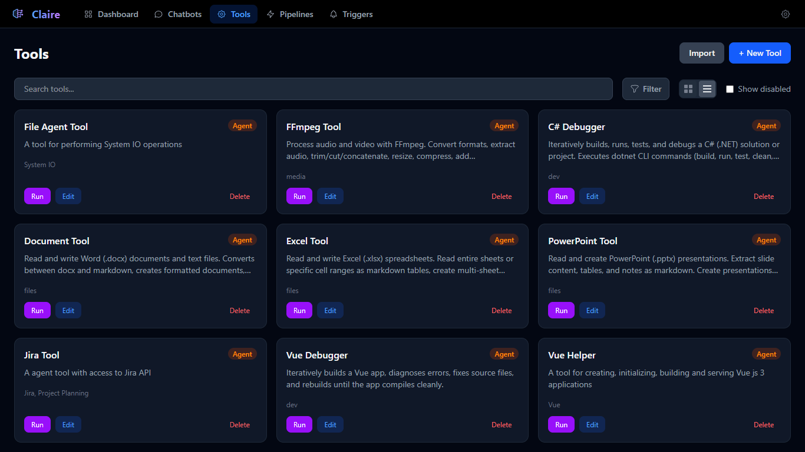
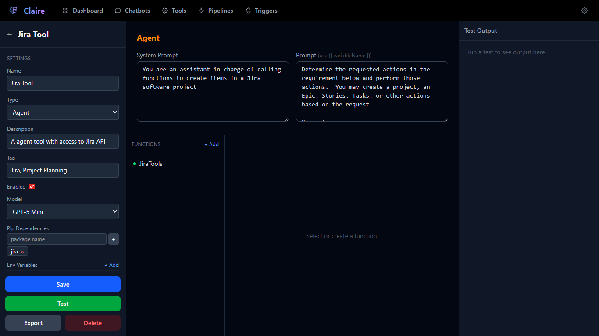
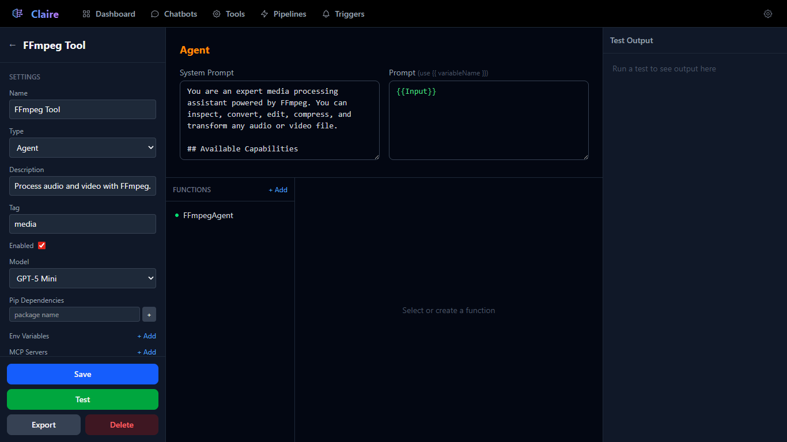
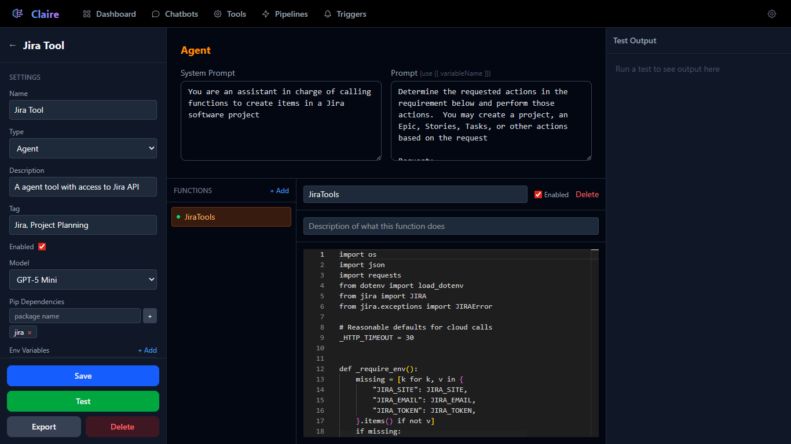
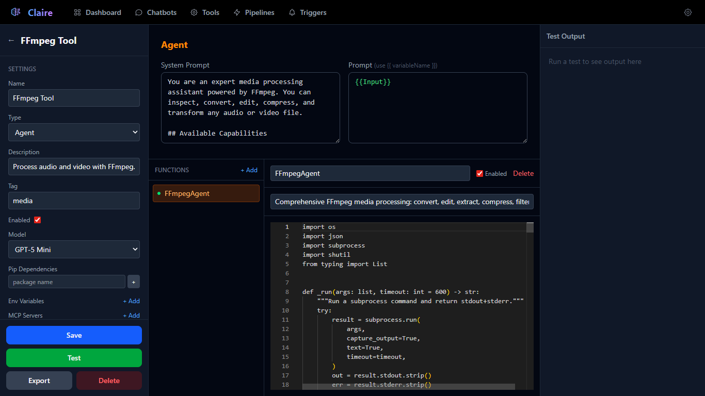
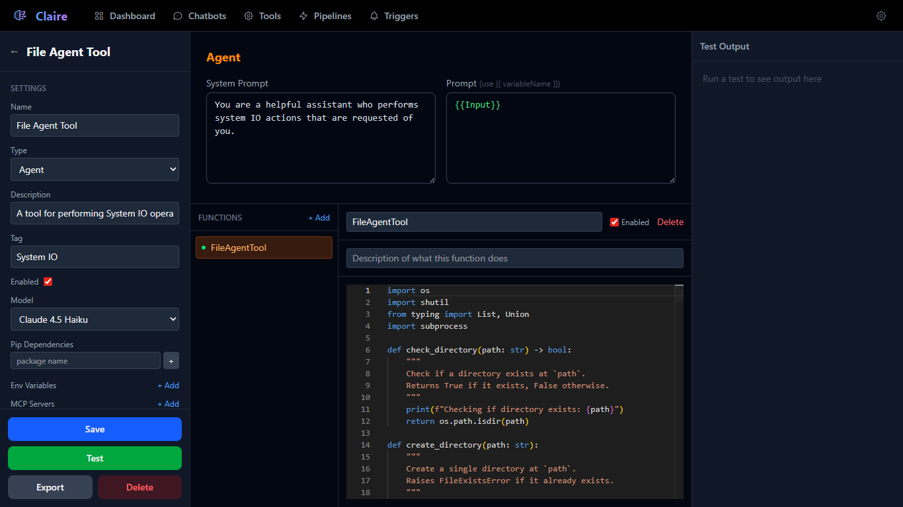
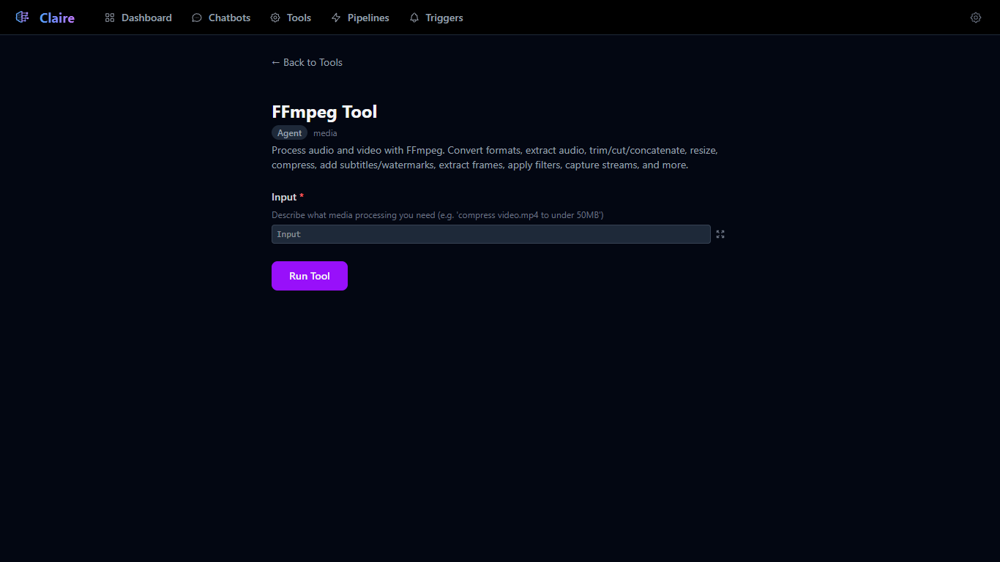
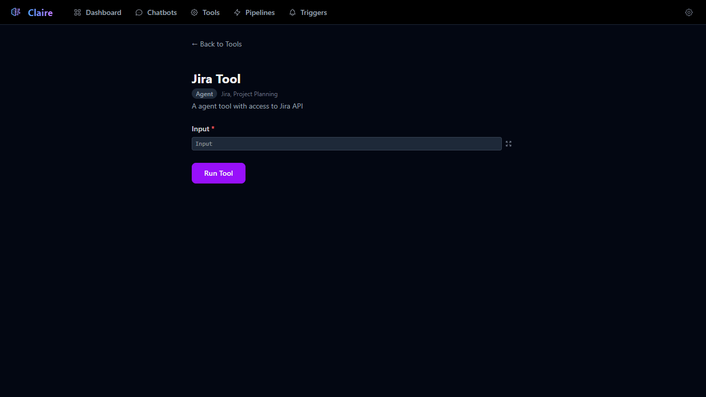
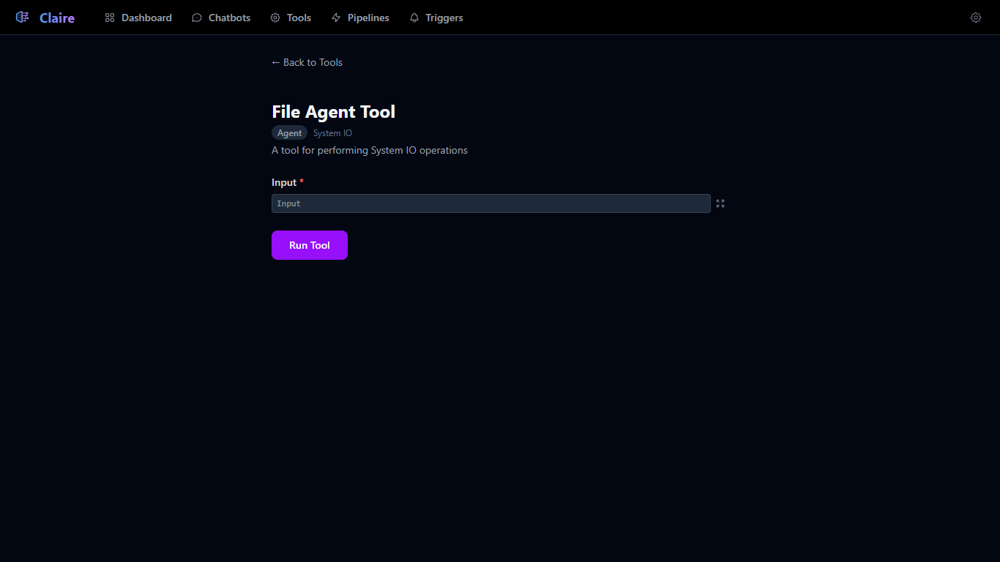

# Tools

Tools are the core building blocks of Claire. Each tool encapsulates a specific capability — from calling an AI model, to making HTTP requests, to running multi-step agent workflows with Python functions and MCP servers. Tools can be run standalone or composed together inside [Pipelines](../Pipelines/Pipelines.md).



---

## Tools List

The Tools page (`/tools`) displays all available tools with two view modes:

- **List view** — Compact rows showing name, type badge, description, tags, and action buttons.
- **Grid view** — Card layout showing the same information in a visual grid.



### Features

| Feature | Description |
|---|---|
| **Search** | Filter tools by name, tag, or description. |
| **Tag Filter** | Multi-select dropdown to filter by specific tags. |
| **Show disabled** | Toggle to reveal disabled tools (hidden by default). |
| **Drag-and-drop** | Reorder tools by dragging — order is persisted. |
| **Import** | Upload a `.json` tool export file to create a new tool. |
| **+ New Tool** | Create a blank tool and open the editor. |

Each tool in the list shows action buttons based on its type:

- **Run** (purple) — Opens the Tool Runner. Only available for runnable types: LLM, Endpoint, and Agent.
- **Edit** (blue) — Opens the Tool Editor.
- **Delete** (red) — Removes the tool (with confirmation).

---

## Tool Types

There are three standalone tool types that can be created and run directly:

| Type | Description |
|---|---|
| **LLM** | Sends a prompt to an AI model (Claude, GPT, Gemini, or Grok) and returns the text response. |
| **Endpoint** | Makes an HTTP request (GET/POST/PUT/DELETE) to an external URL and returns the response. |
| **Agent** | An agentic LLM loop where the selected model (Claude, GPT, Gemini, or Grok) can call Python functions and MCP server tools iteratively until it produces a final response. |

Additional types exist for use exclusively within Pipelines as control flow nodes:

| Type | Purpose |
|---|---|
| Start | Entry point of a pipeline. |
| End | Marks the end of a pipeline branch. |
| Pause | Pauses execution at that step. |
| If | AI-powered conditional branch — routes to true/false paths. |
| Parallel | Fan-out node for parallel execution. |
| Wait | Converges parallel branches before continuing. |
| Pipeline | Runs another pipeline as a nested sub-step. |
| LoopCounter | Counts iterations and halts after a max count. |
| AskUser | Pauses to ask the user questions, then resumes with answers. |
| FileUpload / FileDownload | File handling nodes. |

---

## Tool Editor

The Tool Editor (`/tool/{id}`) is a three-panel layout for configuring every aspect of a tool.

### Left Panel — Settings



#### Common Settings (all types)

| Field | Description |
|---|---|
| **Name** | Display name shown in lists, runner, and pipeline nodes. |
| **Type** | LLM, Endpoint, or Agent. Changing this reconfigures the entire editor. |
| **Description** | Free-text description shown in the tools list and runner page. |
| **Tag** | Comma-separated tags for filtering and organization. |
| **Enabled** | Toggle to enable/disable the tool. Disabled tools are hidden from the list by default. |

#### LLM-Specific Settings

| Field | Description |
|---|---|
| **Model** | Which AI model to use for this tool. |

#### Agent-Specific Settings

| Field | Description |
|---|---|
| **Model** | Which AI model to use for the agent loop (e.g., Claude 4.5 Haiku, GPT-5 Mini, Gemini 2.5 Flash, Grok 3 Mini). |
| **Pip Dependencies** | Python packages to install when the tool is saved. Add a package name and it will be installed via `pip install`. Success/failure results are shown inline. |
| **Env Variables** | Named variables (Text or Secret type) that can be accessed in function code via `get_var("VAR_NAME")`. Actual values are managed in Settings > Custom Variables. |
| **MCP Servers** | Configure external Model Context Protocol servers. Each server supports Stdio (subprocess) or HTTP/SSE transport, with a Test button to discover available tools. |

#### Endpoint-Specific Settings

| Field | Description |
|---|---|
| **Method** | HTTP method: GET, POST, PUT, or DELETE. |

#### Inputs

Every tool has configurable inputs. A default "Input" field is created automatically. Each input has:

- **Name** — The variable name, usable as `{{Name}}` in prompts.
- **Type** — Text, Number, Boolean, Date, Password, or Select (dropdown).
- **Required** — Whether the input must be provided.
- **Test value** — A value for testing (not persisted to the database).

For Select-type inputs, you can define a list of options with name/value pairs and a default selection.

### Middle Panel — Prompts, Functions & Configuration

The middle panel content changes based on the tool type.

#### LLM Type

A single **Prompt** textarea with template variable support. Type `{{` to trigger autocomplete for available input variables.

#### Endpoint Type

Three fields, all with template variable support:
- **URL** — The endpoint to call.
- **Headers (JSON)** — Request headers as JSON.
- **Body (JSON)** — Request body as JSON.

#### Agent Type

The Agent editor has three sections:

**1. System Prompt & Prompt**

Side-by-side textareas. The **System Prompt** defines the agent's role and behavior. The **Prompt** is the user message sent to the model — typically contains `{{Input}}` to inject user input.



**2. MCP Tool Selection** (when MCP servers are configured)

After testing an MCP server connection, discovered tools appear here with checkboxes to allow or disallow individual tools. By default all discovered tools are available to the agent.

**3. Functions Panel**

The functions panel is split into a list of functions (left) and a code editor (right). This is where you define the Python functions that the agent can call. See [Functions](#functions) below.

### Right Panel — Test Output

Click the **Test** button to run the tool via WebSocket and see real-time streaming output:

- Text responses stream in as they're generated.
- Tool calls show as `[Tool Call: functionName({args})]`.
- Tool results show as `[Result: returnValue]`.
- Errors are displayed inline.
- Usage stats at the end show: model name, input/output token counts, and cost.

### Action Buttons

| Button | Description |
|---|---|
| **Save** | Persists the tool, installs pip dependencies, and syncs env variable schemas. |
| **Test** | Runs the tool via WebSocket with streaming output in the Test Output panel. |
| **Export** | Downloads the tool as a `.json` file for backup or sharing. |
| **Delete** | Permanently removes the tool. |

---

## Functions

Functions are Python code blocks that give Agent-type tools the ability to interact with external systems, files, APIs, and more. Each function becomes a tool that Claude can call during the agent loop.



### Creating a Function

1. Click **+ Add** in the Functions panel.
2. A new function is created with a default template:
   ```python
   def func_XXXXXX(input: str) -> str:
       """Description of what this function does."""
       return input
   ```
3. Rename the function, write a description, and implement the code.

### Function Properties

| Property | Description |
|---|---|
| **Name** | The function name — this is what Claude sees and calls. Must be a valid Python identifier. |
| **Description** | Plain-text description shown above the code editor. This is passed to Claude as the tool description and helps it understand when/how to use the function. |
| **Enabled** | Toggle to include or exclude the function from the agent's available tools. |
| **Code** | Full Python code in the Monaco editor. Write standard Python — import libraries, define helper functions, and export one main callable. |

### How Functions Are Executed

1. **On save**, each enabled function is written to disk as a `.py` file at `data/agents/{toolName}_{toolId}/{functionName}.py`.
2. **At runtime**, functions are dynamically loaded via `importlib`. The system inspects each function's signature to auto-generate a JSON schema for Claude:
   - Parameter names become property names.
   - Python type hints map to JSON types: `str` -> string, `int` -> integer, `float` -> number, `bool` -> boolean, `list` -> array.
   - Parameters without defaults become required.
   - The docstring becomes the tool description.
3. **When Claude calls a function**, it's executed with a 15-minute timeout. Results are converted to strings and fed back to Claude as tool results.

### Accessing Environment Variables

Environment variables declared in the tool settings can be accessed in function code:

```python
# Using the injected helper
value = get_var("JIRA_TOKEN")

# Variables are also injected as module-level globals
print(JIRA_TOKEN)
```

### Example: Jira Tool Functions


The Jira Tool demonstrates a practical agent function that:
- Imports the `jira` Python library (declared as a pip dependency).
- Reads environment variables (`JIRA_SITE`, `JIRA_EMAIL`, `JIRA_TOKEN`) via `get_var()`.
- Exposes functions for creating projects, epics, stories, and tasks in Jira.
- Claude determines which functions to call based on the user's natural language request.

### Example: FFmpeg Tool Functions



The FFmpeg Tool shows an agent that:
- Uses `subprocess` to run FFmpeg commands.
- Provides functions for media inspection, conversion, editing, and compression.
- Claude translates natural language requests like "compress video.mp4 to under 50MB" into the appropriate FFmpeg commands.

### Example: File Agent Tool Functions



The File Agent Tool provides system I/O capabilities:
- Uses `os`, `shutil`, and `subprocess` for file operations.
- Functions include: `check_directory`, `create_directory`, `list_directory`, `read_file`, `write_file`, and more.
- Claude can perform file management tasks based on natural language instructions.

---

## Tool Runner

The Tool Runner (`/tool-runner/{id}`) provides a simple interface for executing a tool with custom input.



### How It Works

1. The runner displays the tool's name, type badge, tags, and description.
2. Input fields are rendered dynamically based on the tool's configured inputs (text fields, dropdowns, checkboxes, etc.).
3. Click **Run Tool** to execute.
4. The system creates a pipeline run behind the scenes and redirects you to the Pipeline Run viewer to see real-time progress and results.

### Runner Examples

| Tool | Runner |
|---|---|
| **Jira Tool** — Simple text input for describing Jira actions. |  |
| **FFmpeg Tool** — Text input with helpful placeholder describing expected input format. |  |
| **File Agent Tool** — Text input for describing file operations. |  |

---

## Template Variables

Template variables allow dynamic content in prompts, URLs, headers, and request bodies using `{{variableName}}` syntax.

### Syntax

| Syntax | Description |
|---|---|
| `{{Input}}` | Replaced with the value of the "Input" field. |
| `{{variableName}}` | Replaced with any named input or pipeline step output. |
| `{{propName[5]}}` | Indexed access for array values. |
| `{{propName[@]}}` | Auto-indexed — resolves to the current iteration index. |
| `{{propName[-1]}}` | Negative index — relative to the current position. |

### Autocomplete

In the editor, typing `{{` triggers an autocomplete dropdown listing all available input variable names. Valid references are highlighted green; unrecognized ones are highlighted red.

### Resolution Order (in Pipeline context)

When a tool runs inside a pipeline, variables are resolved in this priority order:
1. The step's own input values.
2. Outputs from previously completed steps.
3. The pipeline's top-level input values.
4. Accumulated pipeline-level outputs.

If the default `{{Input}}` is still empty after resolution, it automatically inherits from the last completed step's output.

---

## Import & Export

### Exporting a Tool

1. Open the tool in the editor.
2. Click **Export** at the bottom of the left panel.
3. A `.json` file is downloaded containing the full tool definition (prompts, functions, settings, inputs).

### Importing a Tool

1. On the Tools list page, click **Import**.
2. Select a `.json` file previously exported from Claire.
3. The tool is created with a new unique ID and opened in the editor.
4. Only files with `_export_type: "tool"` are accepted.

---

## Agent Execution Details

When an Agent-type tool runs, it follows an iterative loop:

1. **Load tools** — Python functions from disk + MCP server tools are loaded and their schemas are generated.
2. **Call Claude** — The system prompt, user prompt, message history, and tool schemas are sent to the model.
3. **Process response** — If Claude returns text, it's streamed to the output. If Claude requests tool calls, they are executed.
4. **Execute tools** — Python functions run with a 15-minute timeout. MCP tools run with a 2-minute timeout.
5. **Feed results back** — Tool results are added to the message history and Claude is called again.
6. **Repeat** — The loop continues until Claude responds without requesting any tool calls, or until limits are reached.

### Limits

| Limit | Value |
|---|---|
| Max iterations | 30 |
| Token budget | 500,000 tokens |
| Python function timeout | 15 minutes |
| MCP tool timeout | 2 minutes |

### Fallback Behavior

If an Agent tool has no functions and no MCP servers configured, it falls back to a standard LLM call (non-agentic) — behaving identically to an LLM-type tool.
