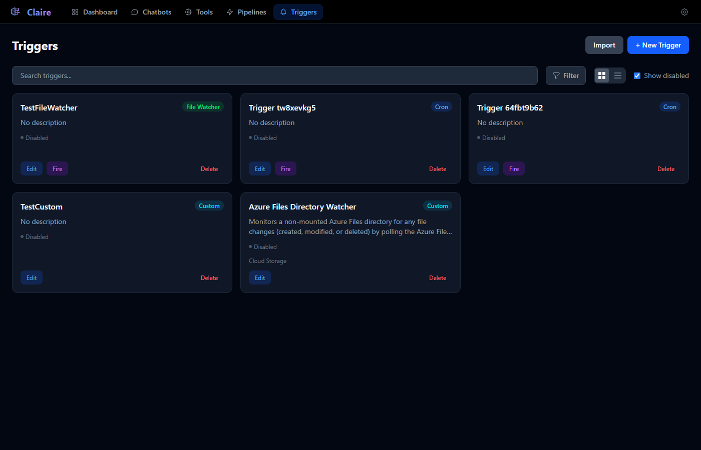
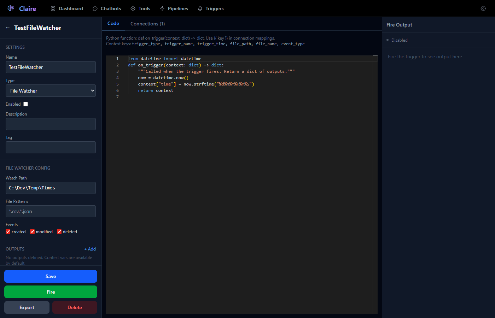
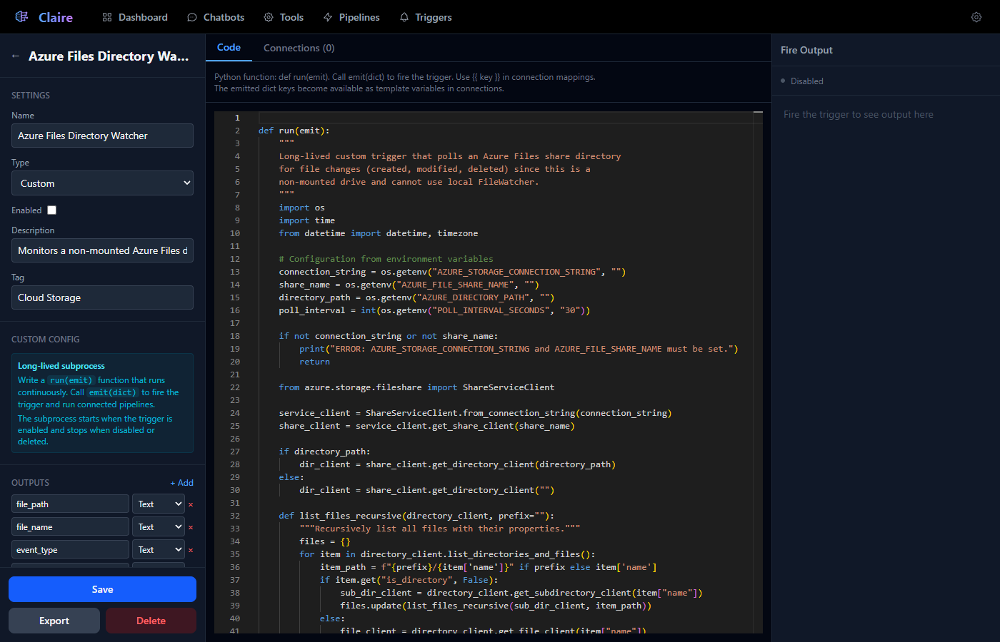
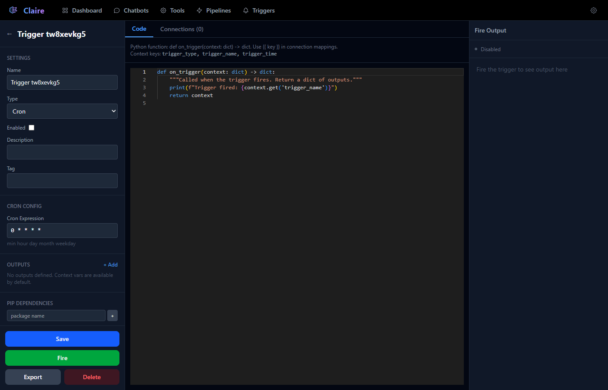
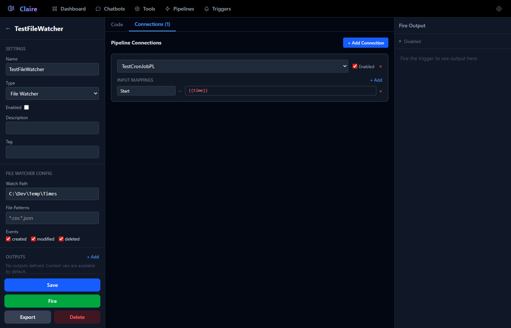

# Triggers

Triggers automate [Pipeline](../Pipelines/Pipelines.md) execution in response to events. When a trigger fires, it executes a Python handler function, builds output variables, and launches connected pipelines with mapped inputs. Claire supports five trigger types: Cron schedules, File Watchers, Webhooks, RSS feeds, and Custom long-lived subprocesses.


---

## Triggers List

The Triggers page (`/triggers`) displays all triggers with two view modes:

- **List view** — Compact rows showing name, type badge, description, fire count, last status, and action buttons.
- **Grid view** — Card layout with the same information in a visual grid.



### Features

| Feature | Description |
|---|---|
| **Search** | Filter triggers by name, tag, or description. |
| **Tag Filter** | Multi-select dropdown to filter by specific tags. |
| **Show disabled** | Checkbox to reveal disabled triggers (checked by default). |
| **Drag-and-drop** | Reorder triggers by dragging — order is persisted. |
| **Import** | Upload a `.json` trigger export file to create a new trigger. |
| **+ New Trigger** | Create a blank trigger and open the editor. |

### Status Indicators

Each trigger in the list shows runtime status:

- **Status dot** — Green if enabled, gray if disabled.
- **Fire count** — Total number of times the trigger has fired.
- **Last status** — "OK" (green) after a successful fire, or the error message (red) if the last fire failed.

### Action Buttons

- **Edit** (blue) — Opens the Trigger Editor.
- **Fire** (purple) — Manually fires the trigger (not available for Custom triggers, which run continuously).
- **Delete** (red) — Removes the trigger (with confirmation).

### Type Badges

| Type | Badge Color |
|---|---|
| Cron | Blue |
| File Watcher | Green |
| Webhook | Purple |
| RSS | Orange |
| Custom | Cyan |

---

## Trigger Types

### Cron

Fires on a schedule defined by a standard 5-field cron expression.

| Field | Position | Values |
|---|---|---|
| Minute | 1 | 0–59 |
| Hour | 2 | 0–23 |
| Day of Month | 3 | 1–31 |
| Month | 4 | 1–12 |
| Day of Week | 5 | 0–6 (Sun–Sat) or MON–SUN |

**Common examples:**

| Expression | Schedule |
|---|---|
| `0 * * * *` | Every hour at minute 0 |
| `*/5 * * * *` | Every 5 minutes |
| `0 9 * * MON-FRI` | Weekdays at 9:00 AM |
| `0 0 * * 0` | Every Sunday at midnight |
| `30 8,12,17 * * *` | Daily at 8:30, 12:30, and 17:30 |

**How it works:** When enabled, an async loop calculates the next fire time using the cron expression, sleeps until that time, then fires the trigger. The loop continues until the trigger is disabled or deleted.

**Context variables available in code:**

| Variable | Description |
|---|---|
| `trigger_type` | Always `0` (Cron). |
| `trigger_name` | The trigger's display name. |
| `trigger_time` | ISO timestamp of when the trigger fired. |

### File Watcher

Monitors a directory for file system changes and fires when matching files are created, modified, or deleted.



**Configuration:**

| Field | Description |
|---|---|
| **Watch Path** | The directory to monitor (recursive). Must exist on the server. |
| **File Patterns** | Comma-separated glob patterns to match filenames (e.g., `*.csv,*.json`). Leave empty to match all files. |
| **Events** | Checkboxes for which events to watch: Created, Modified, Deleted. |

**How it works:** Uses the Python `watchdog` library to monitor the directory. File events are debounced (2-second window) to prevent duplicate fires from rapid file system changes. Moved files are treated as modifications.

**Context variables available in code:**

| Variable | Description |
|---|---|
| `trigger_type` | Always `1` (FileWatcher). |
| `trigger_name` | The trigger's display name. |
| `trigger_time` | ISO timestamp of when the event occurred. |
| `file_path` | Full path of the affected file. |
| `file_name` | Filename only (e.g., `report.csv`). |
| `event_type` | One of: `created`, `modified`, `deleted`. |

### Webhook

Receives HTTP POST requests at an auto-generated URL. Use this to connect external services (GitHub, Slack, CI/CD systems, etc.) to Claire.

**Configuration:**

The editor displays the webhook URL, which is automatically generated:
```
http://your-server:8000/api/triggers/{trigger_id}/webhook
```

Click the copy button to copy the URL to your clipboard. Share this URL with the external service that should trigger the pipeline.

**How it works:** Webhook triggers have no background loop. They fire when an HTTP POST request is received at the webhook URL. The request body is parsed as JSON (with fallback to plain text), and all body keys are flattened into the context.

**Context variables available in code:**

| Variable | Description |
|---|---|
| `trigger_type` | Always `2` (Webhook). |
| `trigger_name` | The trigger's display name. |
| `trigger_time` | ISO timestamp of when the webhook was received. |
| `webhook_body` | The full request body as a JSON string. |
| `webhook_method` | HTTP method (typically `POST`). |
| `webhook_content_type` | The `Content-Type` header value. |
| `webhook_headers` | All request headers as a JSON string. |
| `body_*` | Flattened body keys. For example, if the body is `{"username": "alice"}`, the context includes `body_username = "alice"`. |

**Example — receiving a GitHub webhook:**
```python
def on_trigger(context: dict) -> dict:
    import json
    body = json.loads(context["webhook_body"])
    return {
        "action": body.get("action", ""),
        "repo": body.get("repository", {}).get("full_name", ""),
        "sender": body.get("sender", {}).get("login", "")
    }
```

### RSS

Polls an RSS or Atom feed at a configurable interval and fires for each new entry.

**Configuration:**

| Field | Description |
|---|---|
| **Feed URL** | The URL of the RSS or Atom feed to poll. |
| **Poll Interval (minutes)** | How often to check for new entries (default: 15 minutes, minimum: 1 minute). |

**How it works:** On startup, all existing feed entries are marked as "seen" (seeded) so only new entries trigger a fire. The loop re-reads the trigger config each cycle, allowing you to change the feed URL or poll interval without restarting. Uses the `feedparser` library for parsing.

**Entry deduplication:** Each entry is identified by its `id`, `link`, or an MD5 hash of its `title` (in that priority order). Once an entry is seen, it is never fired again.

**Context variables available in code:**

| Variable | Description |
|---|---|
| `trigger_type` | Always `3` (RSS). |
| `trigger_name` | The trigger's display name. |
| `trigger_time` | ISO timestamp of when the entry was detected. |
| `feed_url` | The feed URL. |
| `entry_title` | The entry's title. |
| `entry_link` | The entry's URL. |
| `entry_summary` | The entry's summary or description. |
| `entry_id` | The entry's unique identifier. |
| `entry_published` | The entry's published date. |

### Custom

A long-lived Python subprocess that runs continuously and fires the trigger programmatically by calling an `emit()` function.



Custom triggers are designed for scenarios that don't fit the other trigger types — polling an API, listening on a socket, monitoring a database, or any long-running process that should fire pipelines when it detects a condition.

**How it works:** When enabled, Claire spawns a Python subprocess that runs the trigger's code. The subprocess communicates back via a JSON-line protocol on stdout. The subprocess starts when the trigger is enabled and stops when disabled or deleted.

**Code signature:**
```python
def run(emit):
    """
    Long-lived function that runs continuously.
    Call emit(dict) to fire the trigger with output data.
    """
    import time
    import os

    api_key = os.getenv("MY_API_KEY", "")

    while True:
        # Do work, check conditions
        data = check_something()

        if should_fire(data):
            emit({"result": data, "status": "ready"})

        time.sleep(60)  # Wait before checking again
```

**Key differences from other trigger types:**
- The function is named `run(emit)` instead of `on_trigger(context)`.
- Environment variables are accessed via `os.getenv()` (subprocess environment) rather than `get_var()`.
- The function runs indefinitely — there is no external scheduling loop.
- Each call to `emit(dict)` fires the trigger with the provided data as outputs.
- The Fire button is not available in the UI (the subprocess runs continuously).
- The subprocess supports a `log` protocol for sending log messages:
  ```python
  # Inside the subprocess, stdout JSON lines:
  {"type": "emit", "data": {"key": "value"}}   # Fire trigger
  {"type": "log", "level": "info", "message": "..."} # Log message
  ```

**Subprocess lifecycle:**
- Starts when the trigger is saved with `Enabled` checked.
- Stops when the trigger is disabled, deleted, or the server shuts down.
- If the subprocess exits unexpectedly, the trigger's last status shows the exit code and stderr output.
- On shutdown, the subprocess is terminated gracefully (SIGTERM) with a 5-second timeout before force-kill.

---

## Trigger Editor

The Trigger Editor (`/trigger/{id}`) is a three-panel layout: a left sidebar for settings, a center area for code and connections, and a right panel showing fire output.

### Left Panel — Settings



#### Common Settings (all types)

| Field | Description |
|---|---|
| **Name** | Display name shown in the list and dashboard. |
| **Type** | Dropdown to select the trigger type: Cron, File Watcher, Webhook, RSS, or Custom. Changing this swaps the code template automatically. |
| **Enabled** | Checkbox to enable/disable the trigger. Enabling starts the background loop; disabling stops it. |
| **Description** | Free-text description. |
| **Tag** | Comma-separated tags for filtering and organization. |

#### Type-Specific Configuration

Below the common settings, a type-specific configuration section appears:

- **Cron** — Cron Expression field with `min hour day month weekday` hint.
- **File Watcher** — Watch Path, File Patterns, and Events checkboxes (created/modified/deleted).
- **Webhook** — Read-only Webhook URL display with copy button.
- **RSS** — Feed URL and Poll Interval (minutes).
- **Custom** — Info box explaining the long-lived subprocess model.

#### Outputs

Click **+ Add** to define named outputs. Each output has:

- **Name** — The output variable name, usable as `{{name}}` in connection mappings.
- **Type** — Text, Number, or Boolean.
- **Delete** — Remove the output.

Outputs define what data the trigger's code returns. Even without explicit outputs, context variables (like `trigger_time`, `file_name`, etc.) are automatically available in connection mappings.

#### Pip Dependencies

Add Python packages that the trigger's code requires. Type a package name and press Enter or click +. Packages are installed via `pip install` when the trigger is saved. Installation results (success or error) are shown inline.

#### Environment Variables

Click **+ Add** to declare environment variables. Each variable has:

- **Name** — The variable name (e.g., `API_KEY`).
- **Type** — Text or Secret (password field).
- **Description** — What the variable is for.

Variable values are managed in **Settings > Custom Variables**. In trigger code:
- **Standard triggers** (Cron, FileWatcher, Webhook, RSS): Access via `get_var("VAR_NAME")`.
- **Custom triggers**: Access via `os.getenv("VAR_NAME")` (injected into subprocess environment).

#### Action Buttons

| Button | Description |
|---|---|
| **Save** | Persists the trigger, saves code to disk, installs pip dependencies, syncs env variables, and starts/stops the background loop based on the Enabled state. |
| **Fire** | Manually fires the trigger (not available for Custom type). Results appear in the right panel. |
| **Export** | Downloads the trigger as a `.json` file. |
| **Delete** | Permanently removes the trigger and stops any background loop. |

---

### Center Panel — Code & Connections

The center panel has two tabs: **Code** and **Connections**.

#### Code Tab

A full-height Python code editor (Monaco with syntax highlighting and LSP support) for writing the trigger's handler function.

The editor shows a hint line above the code listing the available context variables for the current trigger type.

**Standard trigger code signature** (Cron, FileWatcher, Webhook, RSS):
```python
def on_trigger(context: dict) -> dict:
    """Called when the trigger fires. Return a dict of outputs."""
    # Access context variables
    name = context["trigger_name"]
    time = context["trigger_time"]

    # Access environment variables
    api_key = get_var("API_KEY")

    # Return outputs for pipeline mappings
    return {"result": "processed", "timestamp": time}
```

**Custom trigger code signature:**
```python
def run(emit):
    """Long-lived function. Call emit(dict) to fire the trigger."""
    import time
    import os

    while True:
        emit({"value": 42})
        time.sleep(300)
```

When the trigger type is changed, the code template automatically swaps to the appropriate signature (if the user hasn't customized the code).

#### Connections Tab



The Connections tab defines which pipelines are launched when the trigger fires.

Click **+ Add Connection** to add a new pipeline connection. Each connection has:

**Pipeline selector** — Dropdown listing all available pipelines. Selecting a pipeline auto-populates the input mappings with the pipeline's defined inputs.

**Enabled checkbox** — Toggle to enable/disable this specific connection without removing it.

**Delete button** — Remove the connection.

**Input Mappings** — After selecting a pipeline, a table of mappings appears:

| Column | Description |
|---|---|
| **Pipeline Input** (left, read-only) | The name of the pipeline's input parameter. Auto-populated from the pipeline definition. |
| **Expression** (right, editable) | A template expression that resolves to the value for this input. Use `{{variable}}` syntax to reference trigger outputs and context variables. |

Click **+ Add** to create additional custom mappings beyond the auto-populated ones.

**Example mappings:**

| Pipeline Input | Expression | Description |
|---|---|---|
| `filename` | `{{file_name}}` | Pass the detected filename to the pipeline. |
| `message` | `File {{file_name}} was {{event_type}}` | Compose a message using multiple variables. |
| `timestamp` | `{{trigger_time}}` | Pass the fire timestamp. |
| `url` | `{{entry_link}}` | Pass the RSS entry URL. |

Template expressions support all the same syntax as pipeline template variables: `{{variable}}`, `{{variable[0]}}`, `{{variable.field}}`, etc. The expression field highlights valid variables in green and unrecognized ones in red.

---

### Right Panel — Fire Output

The right panel shows trigger status and the result of the last fire:

- **Status indicator** — Green dot with "Enabled" or gray dot with "Disabled".
- **Fire count** — Total number of fires.
- **Last fired** — Timestamp of the last fire.
- **Last status** — "OK" or error message.
- **Fire result** — JSON output from the last fire (populated when you click the Fire button).

---

## How Triggers Fire

When a trigger fires (either from a schedule, event, or manual fire), the following sequence occurs:

1. **Build context** — A context dictionary is assembled with trigger metadata and type-specific event data.

2. **Execute code** — The trigger's `on_trigger(context)` function is called (skipped for Custom triggers, which use `emit()` instead).
   - Environment variables from the Custom Variables settings are injected.
   - The function receives the full context dictionary.
   - If the function returns a dictionary, it becomes the trigger's outputs.
   - If the function raises an exception, the trigger's last status is set to the error and no pipelines are launched.

3. **Fire connected pipelines** — For each enabled connection:
   - Each input mapping expression is resolved using the trigger's outputs and context variables.
   - A new pipeline run is created with the resolved inputs.
   - The pipeline is launched asynchronously in the background.
   - The trigger doesn't wait for pipelines to complete.

4. **Update status** — The trigger's `last_fired_at`, `last_status`, and `fire_count` are updated in the database.

---

## AI Assist

Click the **AI Assist** button in the left panel to open a dialog where you can describe a trigger in natural language. Select a model, type your description, and click Generate.

The AI generates a complete trigger configuration including:
- Name, description, tag, and trigger type
- Type-specific settings (cron expression, watch path, feed URL, etc.)
- Python handler code
- Output definitions
- Pip dependencies and environment variables
- Pipeline connections with input mappings

Click **Apply to Trigger** to merge the generated configuration into the current trigger.

---

## Import & Export

### Exporting a Trigger

1. Open the trigger in the editor.
2. Click **Export** at the bottom of the left panel.
3. A `.json` file is downloaded containing the full trigger definition.

### Importing a Trigger

1. On the Triggers list page, click **Import**.
2. Select a `.json` file previously exported from Claire.
3. The trigger is created with a new unique ID.
4. Only files with `_export_type: "trigger"` are accepted.
5. You are navigated to the editor for the new trigger.

---

## Startup & Lifecycle

### Application Startup

When Claire starts, all enabled triggers (except Webhooks) are automatically started:
- **Cron** triggers begin their scheduling loops.
- **File Watcher** triggers start monitoring their directories.
- **RSS** triggers seed their seen-entries list and begin polling.
- **Custom** triggers spawn their subprocesses.

### Saving a Trigger

When you save a trigger:
1. The Python code is written to disk at `data/triggers/{name}_{id}/on_trigger.py`.
2. Pip dependencies are installed.
3. Environment variable schemas are synced to the database.
4. If the trigger is enabled (and not a Webhook), the background loop is started or restarted.
5. If the trigger is disabled, any running loop is stopped.

### Disabling / Deleting

- **Disabling** stops the background loop but preserves the trigger configuration.
- **Deleting** stops the loop, removes the trigger from the database, and deletes associated custom variables.

---

## Examples

### Example 1: Cron — Daily Report Generator

Create a trigger that runs a report pipeline every morning at 9 AM on weekdays.

**Settings:**
- Type: Cron
- Cron Expression: `0 9 * * MON-FRI`
- Enabled: Yes

**Code:**
```python
def on_trigger(context: dict) -> dict:
    from datetime import datetime
    return {
        "date": datetime.now().strftime("%Y-%m-%d"),
        "type": "daily"
    }
```

**Outputs:** `date` (Text), `type` (Text)

**Connection:** Link to "Generate Report" pipeline, mapping `{{date}}` to the pipeline's Date input and `{{type}}` to the Report Type input.

### Example 2: File Watcher — CSV Processor

Create a trigger that processes new CSV files dropped into a directory.

**Settings:**
- Type: File Watcher
- Watch Path: `C:\Data\Inbox`
- File Patterns: `*.csv`
- Events: Created only

**Code:**
```python
def on_trigger(context: dict) -> dict:
    return {
        "filepath": context["file_path"],
        "filename": context["file_name"]
    }
```

**Outputs:** `filepath` (Text), `filename` (Text)

**Connection:** Link to "Process CSV" pipeline, mapping `{{filepath}}` to the pipeline's FilePath input.

### Example 3: Webhook — GitHub Push Handler

Create a trigger that receives GitHub push webhooks and extracts commit information.

**Settings:**
- Type: Webhook
- Enabled: Yes
- Copy the webhook URL and add it to your GitHub repository's webhook settings.

**Code:**
```python
def on_trigger(context: dict) -> dict:
    import json
    body = json.loads(context["webhook_body"])
    commits = body.get("commits", [])
    return {
        "repo": body.get("repository", {}).get("full_name", ""),
        "branch": body.get("ref", "").replace("refs/heads/", ""),
        "commit_count": str(len(commits)),
        "latest_message": commits[-1]["message"] if commits else ""
    }
```

**Outputs:** `repo` (Text), `branch` (Text), `commit_count` (Number), `latest_message` (Text)

### Example 4: RSS — News Monitor

Create a trigger that monitors a news feed and summarizes new articles.

**Settings:**
- Type: RSS
- Feed URL: `https://news.ycombinator.com/rss`
- Poll Interval: 30 minutes

**Code:**
```python
def on_trigger(context: dict) -> dict:
    return {
        "title": context["entry_title"],
        "url": context["entry_link"],
        "summary": context.get("entry_summary", "No summary available")
    }
```

**Outputs:** `title` (Text), `url` (Text), `summary` (Text)

**Connection:** Link to "Summarize Article" pipeline, mapping `{{title}}` and `{{url}}` to the pipeline's inputs.

### Example 5: Custom — Azure File Share Monitor

Create a long-lived trigger that polls an Azure File Share for changes (useful when the file system isn't locally mounted).

**Settings:**
- Type: Custom
- Env Variables: `AZURE_STORAGE_CONNECTION_STRING` (Secret), `AZURE_FILE_SHARE_NAME` (Text), `POLL_INTERVAL_SECONDS` (Text)

**Code:**
```python
def run(emit):
    import os
    import time

    connection_string = os.getenv("AZURE_STORAGE_CONNECTION_STRING", "")
    share_name = os.getenv("AZURE_FILE_SHARE_NAME", "")
    poll_interval = int(os.getenv("POLL_INTERVAL_SECONDS", "30"))

    from azure.storage.fileshare import ShareServiceClient
    client = ShareServiceClient.from_connection_string(connection_string)
    share = client.get_share_client(share_name)

    known_files = set()
    # Seed known files on startup
    for item in share.get_directory_client("").list_directories_and_files():
        known_files.add(item["name"])

    while True:
        time.sleep(poll_interval)
        current_files = set()
        for item in share.get_directory_client("").list_directories_and_files():
            current_files.add(item["name"])

        new_files = current_files - known_files
        for f in new_files:
            emit({"file_name": f, "event_type": "created"})

        known_files = current_files
```

**Outputs:** `file_name` (Text), `event_type` (Text)

**Pip Dependencies:** `azure-storage-file-share`
