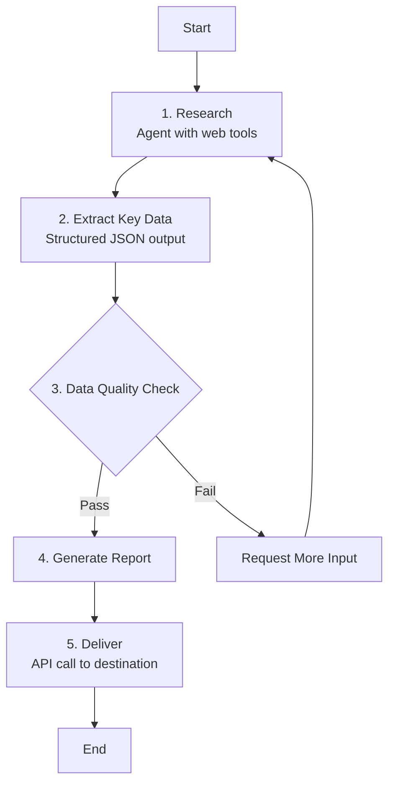
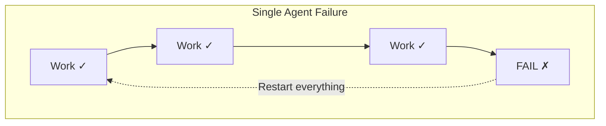
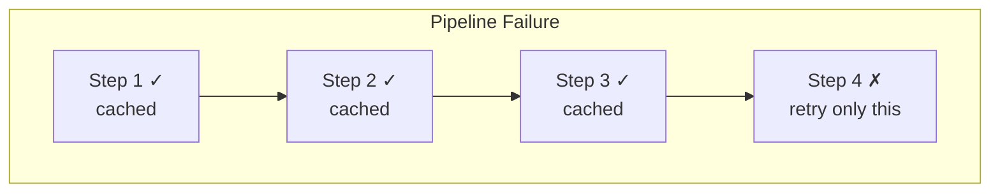
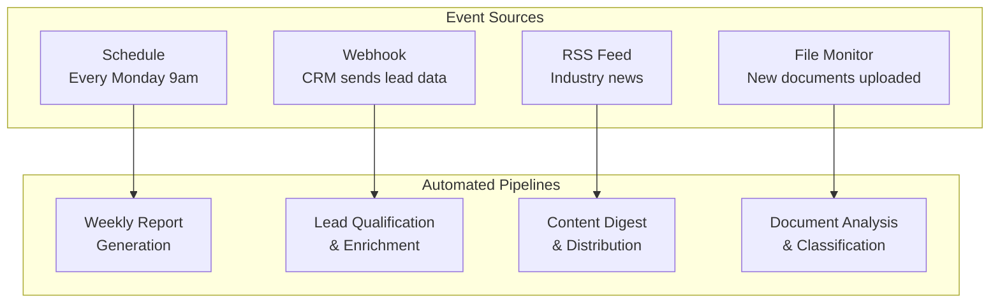

# From Prompt to Pipeline: Making AI Reliable Enough for Production

**Why single-agent AI fails in production — and how structured orchestration fixes it**

*CLAIRE Executive Whitepaper | 2026*

---

## Executive Summary

Organizations deploying AI face a fundamental problem: **large language models are powerful but unreliable.** A single AI agent given a complex task will produce different output formats across runs, silently compound errors, fail without recovery options, and generate unpredictable costs. These are not edge cases — they are inherent to how single-agent AI works, and they make production deployment a liability.

CLAIRE solves this through **pipeline orchestration** — breaking complex AI tasks into multi-step workflows where each step has its own model, its own guardrails, and its own output contract. The result:

- **Consistent output**, every run — structured contracts at each step boundary eliminate format drift and ensure downstream systems receive the data shape they expect
- **Isolated failures** — when step 8 of 10 fails, only step 8 retries; the work from steps 1-7 is preserved
- **Auditable decisions** — every branching point logs its reasoning; every step records its inputs, outputs, and cost
- **Predictable costs** — fixed step counts with right-sized models replace the unpredictable token consumption of autonomous agents
- **Event-driven automation** — triggers connect external events (schedules, webhooks, file changes, RSS feeds) to pipelines without human initiation

The bottom line: **a single AI agent is a prototype; a pipeline is a product.** Organizations that treat AI as an engineering discipline — with typed data flow, failure isolation, and structured contracts — will ship reliable AI systems. Those that rely on increasingly complex prompts will continue to debug production failures.

---

## The Risk: Why Single-Agent AI Breaks in Production

### The Consistency Problem

When a single AI agent handles a complex task, it must encode everything in one prompt: the instructions, the context, the format requirements, the edge cases. As task complexity grows, three failure modes emerge:

**Format drift.** The same prompt produces differently shaped responses across runs. Monday's output is valid JSON. Tuesday's output wraps the JSON in markdown. Wednesday's output is narrative text with data embedded in sentences. Any system consuming this output breaks intermittently — the worst kind of bug.

**Hallucination compounding.** When one prompt asks for research, analysis, AND recommendations, errors compound silently. If the agent fabricates a data point during research, the analysis builds on that fabrication, and the recommendation presents it as established fact. There are no checkpoints where intermediate results can be verified.

**Context overload.** As tasks grow complex, more instructions and context get packed into the prompt. Beyond a threshold, the AI loses focus — the signal drowns in the noise. Adding more context becomes counterproductive.

### The Cost Problem

Autonomous AI agents — where the model decides which tools to call and in what order — are powerful but financially unpredictable. The same task might take 3 tool calls one day and 25 the next. Cost forecasting becomes impossible. When an agent fails after consuming thousands of tokens of processing, all that work is lost — the entire task must restart from scratch.

### The Accountability Problem

When a single agent produces a wrong answer, diagnosing the cause requires replaying the entire conversation log. The causal chain between decisions is implicit — determined by the AI at runtime, not by engineers at design time. In regulated industries, this lack of auditability is a compliance risk.

---

## The Solution: Pipeline Orchestration

CLAIRE replaces single-agent complexity with **structured multi-step workflows** where each step is specialized, bounded, and verifiable.

### How Pipelines Work

A pipeline is a directed graph of steps connected by explicit data flow. Each step performs one focused sub-task with its own AI model, its own instructions, and its own output schema.

Instead of one AI call doing everything, the pipeline decomposes the task:

- **Step 1** uses a powerful model with tool access to gather raw information
- **Step 2** uses a mid-tier model to extract structured data with a guaranteed JSON format
- **Step 3** explicitly checks data quality — no hoping the AI "handles edge cases"
- **Step 4** synthesizes the findings into a report, receiving clean structured data as input
- **Step 5** delivers the result via API — deterministic, no AI involvement

Each step's output flows to the next via **template variables** — explicit, engineer-defined wiring. Step 4's prompt receives `{{ExtractStep.findings}}` — the exact structured data from Step 2. This is deterministic data plumbing, not the AI deciding what to remember.

### Five Pillars of Production Reliability

#### 1. Structured Output Contracts

Every step can enforce a JSON schema on its output using Claude's structured output capability. This is not a prompt instruction that the AI might ignore — it is a structural constraint enforced at the API level. The output either conforms to the schema or the call fails cleanly.

When Step 2 guarantees its output contains `{themes: [{name, evidence, confidence}]}`, Step 4 can reference `{{Step2.themes}}` with certainty that the field exists. This creates **typed data flow** between steps — analogous to type-safe interfaces in software engineering.

The result: output consistency approaches 100% across runs, compared to 70-90% for single-agent approaches with prompt-based format instructions.

#### 2. Failure Isolation and Recovery

When a step fails, only that step retries — with automatic exponential backoff (2 seconds, 4 seconds, 6 seconds). All previously completed steps retain their outputs.

In a 10-step pipeline, failure at step 8 wastes only step 8's cost. In a single-agent approach, the same failure wastes 100% of the tokens consumed across all prior reasoning.

Operators can also **rerun from any step** — preserving earlier results while re-executing from the point of failure. And steps can be configured to **pause for human review** before continuing, enabling human-in-the-loop workflows.

#### 3. Auditable Decision Trail

Every step in a pipeline records:

- **What it received** — the resolved input after template variable substitution
- **What it produced** — the full output (structured or text)
- **What it cost** — model used, input tokens, output tokens, computed cost
- **What it decided** — for branching steps, the boolean decision AND the reasoning

When a pipeline produces an unexpected result, engineers can trace exactly which step diverged, what data it received, and what decision it made. This is not a conversation log to wade through — it is a structured execution trace with per-step accountability.

For regulated industries, this audit trail transforms AI from an opaque black box into a transparent, auditable process.

#### 4. Cost Predictability and Optimization

Pipelines provide two cost levers unavailable to single-agent approaches:

**Right-sized models per step.** A classification step that answers yes/no does not need the most powerful (and expensive) model. A pipeline can use a fast, inexpensive model for simple steps and reserve the powerful model for steps requiring deep reasoning.

| Approach | Classification | Analysis | Synthesis | Total |
|----------|---------------|----------|-----------|-------|
| Single Agent (all premium) | $0.005 | $0.01 | $0.015 | $0.03/run |
| Pipeline (right-sized) | $0.0002 | $0.004 | $0.015 | $0.019/run |
| **Savings** | | | | **37%** |

At thousands of runs per day, these savings compound substantially.

**Predictable step count.** A pipeline has a fixed number of steps with known models. Cost per run is predictable and forecastable. An autonomous agent may use 3 iterations or 28 — making budgeting impossible.

#### 5. Event-Driven Automation

Pipelines execute in response to external events without human initiation:

Each trigger maps its event data to pipeline inputs via configurable connections. An RSS trigger maps article titles and summaries to pipeline inputs. A webhook maps CRM lead data. The pipeline executes end-to-end — classify, extract, process, deliver — with full audit trails and failure recovery.

This transforms AI from a tool that humans invoke into **infrastructure that operates autonomously** within defined guardrails.

---

## The Interconnectivity Advantage

The deepest benefit of pipeline orchestration is not any single feature — it is the ability to **compose specialized AI agents into reliable systems**.

### Specialization Over Generalization

A single agent handling a complex task is a generalist — adequate at everything, excellent at nothing. A pipeline decomposes that task into steps where each step is a specialist:

- A **research agent** with web search capabilities focuses only on gathering data
- An **extraction step** with a structured output schema focuses only on organizing that data
- A **quality gate** focuses only on validating completeness
- A **synthesis step** focuses only on drawing conclusions from clean, structured inputs

Each specialist receives focused context and instructions. The research agent does not need to "also remember to format the output as JSON." The synthesis step does not need to "also search the web for more data." Specialization improves quality because each AI call has a clear, bounded task.

### Bounded Autonomy

Agent steps within pipelines maintain their power — they can call tools, execute code, and query external systems over multiple iterations. But their output is constrained by the pipeline's structured output contracts. The agent reasons freely during its step, but its final output to the pipeline conforms to a guaranteed schema.

This is **bounded autonomy**: maximum flexibility within each step, maximum consistency across the pipeline.

### Reusable Components

Pipelines can contain other pipelines as steps. A "data extraction" pipeline built and validated once can be embedded inside a "weekly report" pipeline, a "compliance audit" pipeline, and a "customer briefing" pipeline. Each nested pipeline executes with full isolation — its own steps, its own error handling, its own cost tracking — while its outputs flow to the parent.

This enables organizations to build a **library of validated AI components** that compose into increasingly sophisticated workflows without increasing risk.

### Selective Memory

Pipeline memory nodes attach to specific steps, providing relevant context without flooding every step with the entire conversation history. A customer research step accesses customer history. A technical analysis step accesses product documentation. Neither step drowns in the other's context.

Two memory types serve different needs:
- **Session memory** persists within a single run — useful for multi-step conversations
- **Long-term memory** persists across runs — enabling pipelines that learn and avoid repetition over time

---

## The Comparison

| Dimension | Single AI Agent | Pipeline Orchestration |
|-----------|----------------|----------------------|
| **Output consistency** | 70-90% schema conformance | ~100% via structured contracts |
| **Failure recovery** | Full restart; all work lost | Per-step retry; prior work preserved |
| **Cost predictability** | Variable (3-28 iterations) | Fixed step count, known models |
| **Cost optimization** | One model for everything | Right-sized model per step |
| **Auditability** | Conversation log (implicit) | Per-step: inputs, outputs, cost, decisions |
| **Edge case handling** | Implicit (hope the prompt covers it) | Explicit branching with logged reasoning |
| **Automation** | Requires human initiation | Event-driven triggers |
| **Reusability** | Copy-paste prompts | Nested pipelines as components |
| **Context management** | Everything in one prompt | Selective memory per step |
| **Debugging** | Replay entire conversation | Inspect the specific step that failed |

---

## When to Use Each Approach

**Use a single agent** for:
- Simple, well-defined tasks (translation, summarization, classification)
- Exploratory work where the path is unknown
- Rapid prototyping before graduating to pipelines

**Use a pipeline** when:
- Output consistency matters (downstream systems depend on the format)
- The task has multiple distinct phases (research → analyze → synthesize)
- Failures must not require full restarts
- Costs must be predictable and optimizable
- Decisions must be auditable
- The workflow runs repeatedly at scale
- Automation without human initiation is required

The threshold is clear: **when AI moves from experimentation to production, it needs engineering discipline.** Pipelines provide that discipline.

---

## Conclusion

The AI industry's current trajectory — larger models, longer context windows, more autonomous agents — addresses capability but not reliability. A more capable model that produces inconsistent output, fails without recovery, and generates unpredictable costs is still a liability in production.

CLAIRE takes a different approach: **make AI reliable through orchestration, not just through model improvements.** Pipeline orchestration provides structured output contracts, failure isolation, auditable decision trails, cost predictability, and event-driven automation. These are not nice-to-have features — they are the minimum requirements for deploying AI as production infrastructure.

The organizations that succeed with AI in production will be those that treat it as an engineering discipline — with typed data flow, bounded autonomy, and structured accountability. Those that rely on increasingly complex prompts to a single agent will continue to debug production failures, explain unpredictable costs, and manage the risk of opaque AI decisions.

**A single agent is a prototype. A pipeline is a product.**

---

*For technical implementation details, architecture deep dives, and code-level documentation, see the companion technical whitepaper: [From Prompt to Pipeline: Technical Deep Dive](whitepaper-pipeline-orchestration.md).*
