# From Prompt to Pipeline: How Multi-Step AI Orchestration Delivers Consistent, Production-Grade Output

**A technical guide to structured LLM pipelines, agent interconnectivity, and deterministic AI workflows**

*CLAIRE Technical Whitepaper | 2026*

---

## Abstract

Large language model applications in production face two fundamental challenges: **output consistency** — getting the same shape and quality of result every time — and **task complexity** — handling multi-faceted work that exceeds a single prompt's capacity. Single-agent approaches, whether one-shot LLM calls or autonomous agentic loops, hit hard ceilings as task complexity grows. Prompt bloat dilutes signal. Format drift produces unparseable results. Hallucination errors compound silently across reasoning steps. Failures require complete restarts.

CLAIRE addresses these challenges through a **pipeline-based orchestration architecture** where complex AI tasks are decomposed into directed acyclic graphs (DAGs) of specialized steps. Each step operates with its own model selection, prompt engineering, structured output schema, and error handling. The template variable system provides deterministic data flow between steps, replacing implicit LLM-decided context with explicit, engineer-defined wiring. Structured output contracts at each step boundary guarantee consistent JSON shapes across runs. Per-step retry with exponential backoff isolates failures. Conditional branching handles edge cases explicitly rather than hoping the model handles them.

This whitepaper demonstrates how interconnecting multiple specialized agents through CLAIRE's pipeline engine produces measurably more consistent, reliable, and auditable results than monolithic single-agent approaches. We examine the execution engine architecture, template resolution system, structured output enforcement, memory injection, trigger-driven automation, and practical orchestration patterns — providing the technical depth needed to evaluate pipeline-based AI orchestration for production deployments.

---

## 1. The Problem with Single-Agent AI

### 1.1 The Single-Call Ceiling

A single LLM call must encode the entire task in one prompt: instructions, context, format requirements, edge-case handling. As task complexity grows, the prompt grows, and signal degrades in the noise.

In CLAIRE, a single tool is represented by an `AiTool` with one `prompt`, one `system_prompt`, one `model`, and one optional `response_structure`. For a task like "research competitors, extract key features, compare against our product, and generate a recommendation report," a single tool must pack all of these sub-tasks into a single prompt. The model must simultaneously understand what to research, how to structure the extraction, the comparison criteria, and the report format.

**Format inconsistency** is the most immediate production problem. Without structured output enforcement, the same prompt produces differently shaped responses across runs. A prompt asking for "a JSON object with competitor names and features" might return valid JSON in 80% of runs, markdown-wrapped JSON in 10%, and narrative text with embedded data in the remaining 10%. Even with CLAIRE's `response_structure` enforcement (which uses Claude's forced `tool_use` to emit schema-compliant JSON), a single call can only enforce one schema for one output — there is no way to enforce intermediate shapes within a multi-step reasoning process.

**Hallucination compounding** is the deeper problem. When one prompt asks for research, analysis, AND recommendations, errors in the research phase propagate silently into analysis and recommendations with no verification checkpoint. If the model hallucinates a competitor feature in the research phase, the analysis phase builds on that hallucination, and the recommendation phase presents it as established fact. There are no intermediate checkpoints where the output can be validated before downstream processing depends on it.

### 1.2 The Agentic Loop's Hidden Costs

Agent tools in CLAIRE represent the most powerful single-tool capability: a multi-turn loop where Claude calls Python functions, MCP servers, and external APIs over up to 30 iterations with a 500,000-token budget. The agent can read files, query databases, call APIs, and execute code — all driven by the model's own reasoning about what to do next.

This is powerful but fundamentally **nondeterministic**. Two runs with identical inputs may traverse completely different tool-call sequences. The model might call a search API first in one run and a database query first in another. It might need 3 iterations or 25. This makes cost forecasting impossible and debugging difficult.

```python
# Agent execution loop (simplified from agent_service.py)
MAX_AGENT_ITERATIONS = 30
TOKEN_BUDGET = 500_000

for iteration in range(MAX_AGENT_ITERATIONS):
    result = await chat_with_tools(messages, all_tool_schemas, model)

    if result["stop_reason"] != "tool_use":
        break  # Agent decided it's done

    # Execute whatever tools the model chose (nondeterministic)
    for tool_call in result["content"]:
        if tool_call["type"] == "tool_use":
            output = await execute_function(tool_call["name"], tool_call["input"])
            messages.append({"role": "user", "content": [tool_result(output)]})
```

The causal chain between tool calls is implicit — determined by the LLM at runtime rather than by the engineer at design time. When an agent produces a wrong answer, you must replay the entire conversation log to understand which tool call went wrong. Compare this with a pipeline where the engineer explicitly wires Step A's output to Step B's input: the data flow is visible in the design, not hidden in a runtime transcript.

### 1.3 The Context Window Trap

As tasks grow complex, the temptation is to dump everything into the system prompt. But context window utilization follows a diminishing-returns curve: adding more context helps up to a point, then starts diluting the model's attention on the actual task.

Memory in single-agent calls is per-call only. If you want the agent to "remember" previous interactions, you prepend the entire conversation history to every call. There is no way to selectively inject relevant context — the model gets everything or nothing.

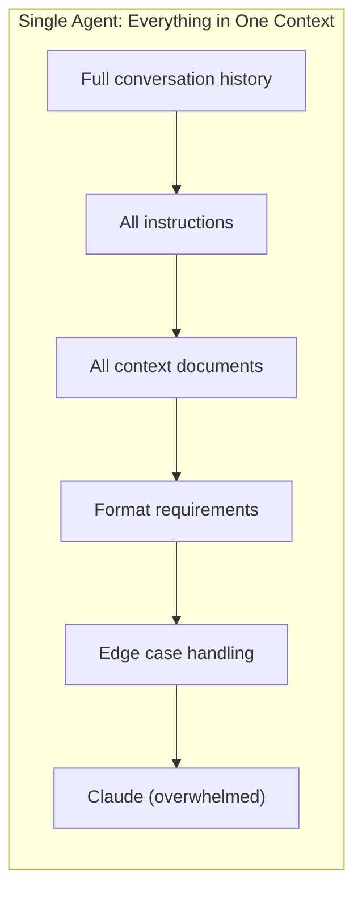

Contrast this with CLAIRE's pipeline memory nodes, where each step can have its own memory scope. A "customer history" memory attaches to the customer research step, while a "technical documentation" memory attaches to the analysis step. Neither step drowns in the other's context.

---

## 2. The Pipeline Model — Decomposition as Architecture

### 2.1 Pipelines as Directed Acyclic Graphs

In CLAIRE, every pipeline is a directed acyclic graph where steps are nodes and edges define execution flow. The pipeline engine performs BFS traversal from designated start steps through the graph, executing each step with its bound tool.

```python
# Core step types (from enums.py)
class ToolType(IntEnum):
    LLM         = 0   # Claude processes a prompt
    Endpoint    = 1   # HTTP API call
    Agent       = 3   # Multi-turn agentic loop with tools
    Pipeline    = 4   # Nested pipeline (recursive execution)
    If          = 5   # Conditional branching (true/false paths)
    Parallel    = 6   # Fan-out to multiple branches
    End         = 7   # Terminal step
    Wait        = 8   # Synchronization barrier
    LoopCounter = 10  # Bounded iteration
    AskUser     = 11  # Multi-round user conversation
    FileUpload  = 12  # User file input
    Task        = 14  # AI-planned sub-orchestration
```

Each step connects to the next via edges with explicit handles. An If step has `next_steps_true` and `next_steps_false` — the engine routes to exactly one based on the boolean evaluation. A step with multiple `next_steps` fans out to parallel branches. A Wait step blocks until all incoming branches complete.

```mermaid
graph TD
    START["Start"] --> RESEARCH["Research (Agent)"]
    RESEARCH --> EXTRACT["Extract Themes (LLM)"]
    EXTRACT --> CHECK{"Sufficient Data? (If)"}
    CHECK -->|true| SYNTHESIZE["Synthesize Report (LLM)"]
    CHECK -->|false| ASKUSER["Request More Context (AskUser)"]
    ASKUSER --> RESEARCH
    SYNTHESIZE --> FORMAT["Format Output (LLM)"]
    FORMAT --> END["End"]

    style START fill:#374151
    style RESEARCH fill:#c2410c
    style EXTRACT fill:#7c3aed
    style CHECK fill:#0369a1
    style SYNTHESIZE fill:#7c3aed
    style ASKUSER fill:#0d9488
    style FORMAT fill:#7c3aed
    style END fill:#374151
```

The execution engine manages this complexity:

```python
# Pipeline execution core (simplified from pipeline_engine.py)
async def run_pipeline(run_id: str):
    pipeline_run = get_by_id("pipeline_runs", run_id)
    steps = pipeline_run["steps"]

    # BFS traversal from start steps
    queue = deque([s["id"] for s in steps if s.get("is_start")])
    visited = set()

    while queue:
        step_id = queue.popleft()
        if step_id in visited:
            continue
        visited.add(step_id)

        step = step_lookup[step_id]
        tool = get_by_id("tools", step["tool_id"])

        # Execute the step with its bound tool
        output = await _execute_step(pipeline_run, step, tool, semaphore)

        # Route to next steps based on type
        next_ids = _get_next_steps(step, output)

        if len(next_ids) > 1:
            # Parallel fan-out
            await _run_parallel_branch(next_ids, pipeline_run, visited, queue)
        else:
            queue.extend(next_ids)
```

### 2.2 Step Specialization

Each step in a pipeline binds to its own tool with its own configuration. This means a single pipeline can use different models, prompts, and output schemas at each stage:

| Step | Tool Type | Model | Purpose |
|------|-----------|-------|---------|
| Research | Agent | Claude Opus | Complex web research requiring tool use |
| Classify | LLM | Claude Haiku | Simple sentiment/category classification |
| Extract | LLM | Claude Sonnet | Structured data extraction |
| Synthesize | LLM | Claude Opus | Deep reasoning and report generation |
| Validate | If | Claude Haiku | Boolean quality check |
| Notify | Endpoint | N/A | HTTP POST to Slack webhook |

Using Haiku for classification steps and Opus for reasoning steps is not just a cost optimization — it is a quality optimization. A classification prompt sent to Opus competes with Opus's tendency toward verbose, nuanced responses. The same prompt sent to Haiku produces a clean, direct classification. Each model is right-sized for its sub-task.

### 2.3 Deterministic Data Flow via Template Variables

The template variable system is the backbone of pipeline consistency. Instead of relying on the LLM to "remember" what previous steps produced, CLAIRE explicitly wires outputs to inputs using the `{{StepName}}` syntax.

```python
# Template resolution (from template_engine.py)
PATTERN = re.compile(r'\{\{(\s*[\w\d_\[\]@\.\- ]+\s*)\}\}')

def parse_text(text: str, props: list, current_index: int | None = None) -> str:
    """Replace {{ variableName }} with values from props list."""
    # Resolution supports:
    #   {{StepName}}              - Full output of a previous step
    #   {{StepName.field.nested}} - Dot-path into JSON output
    #   {{StepName[0]}}           - Array index access
    #   {{StepName[@]}}           - Relative index (for iterations)
```

When a pipeline executes, each step's prompt is resolved against a chain of available properties:

1. **Previous step outputs** — `{{ResearchStep}}` resolves to that step's output
2. **Step action parameters** — Tool call summaries from agent steps
3. **Pipeline inputs** — User-provided values at run start
4. **Pipeline outputs** — Accumulated results from all completed steps

This is **deterministic data plumbing**. The engineer specifies exactly which data goes where. A prompt like `"Analyze the following research findings: {{ResearchStep.findings}}"` always receives the structured findings from the research step — it does not rely on the model to recall what was found earlier.

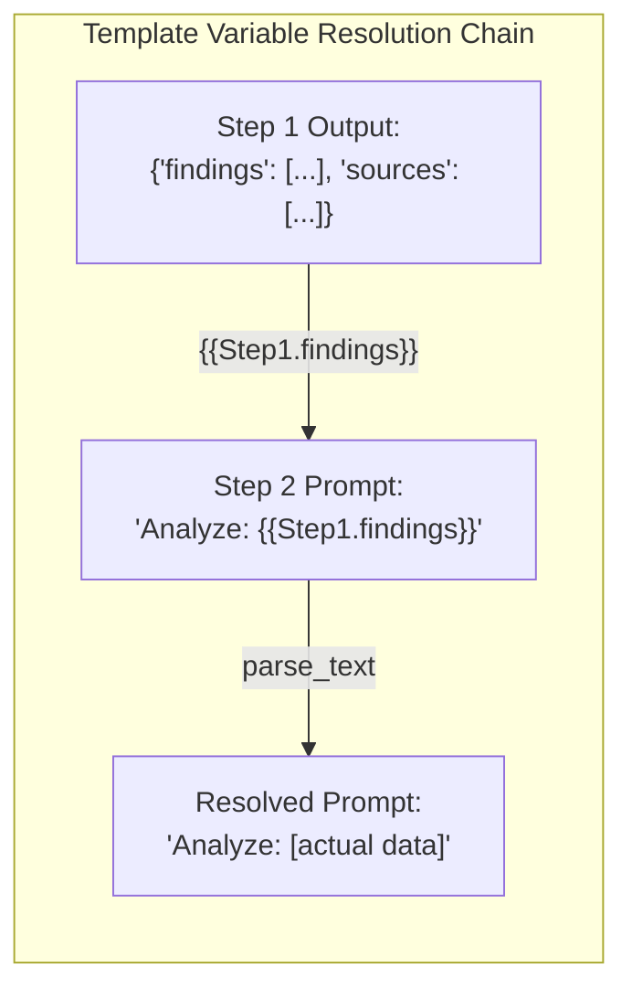

---

## 3. Consistency Through Structured Contracts

### 3.1 Response Structures as Step Contracts

Each tool in CLAIRE can define a `response_structure` — a tree of typed fields that the LLM must return. The engine converts this tree to a JSON Schema and forces Claude to respond using a `tool_use` call with that schema, guaranteeing the output shape on every run.

```python
# response_structure definition on a tool
response_structure = [
    {"key": "status", "type": "string"},
    {"key": "themes", "type": "object", "children": [
        {"key": "name", "type": "string"},
        {"key": "evidence", "type": "string"},
        {"key": "confidence", "type": "number"}
    ]},
    {"key": "recommendation", "type": "string"}
]
```

The engine converts this to a JSON Schema and creates a forced tool call:

```python
# From pipeline_engine.py — structured output enforcement
def _build_json_schema(fields: list[dict]) -> dict:
    """Convert ResponseField[] tree to JSON Schema for forced tool_use."""
    props = {}
    required = []
    for f in fields:
        key = f.get("key", "")
        ft = f.get("type", "string")
        children = f.get("children", [])
        if ft == "object" and children:
            props[key] = _build_json_schema(children)  # Recursive
        elif ft == "number":
            props[key] = {"type": "number"}
        elif ft == "boolean":
            props[key] = {"type": "boolean"}
        else:
            props[key] = {"type": "string"}
        required.append(key)
    return {"type": "object", "properties": props, "required": required}

# Force Claude to use the schema
struct_tool = {
    "name": "structured_output",
    "description": "Return the response in the required structured format.",
    "input_schema": schema,
}
result = await chat_with_tools(
    messages, [struct_tool], model, system_prompt,
    tool_choice={"type": "tool", "name": "structured_output"},
)
```

By setting `tool_choice` to force the `structured_output` tool, Claude must return its response as the tool's input — which must conform to the JSON Schema. This is not a suggestion or instruction to the model; it is a structural constraint enforced by the API. The result is a **step contract**: downstream steps can reference `{{StepName.themes.name}}` with confidence that the field exists and is a string.

When every step enforces a schema, the pipeline's data flow becomes typed:

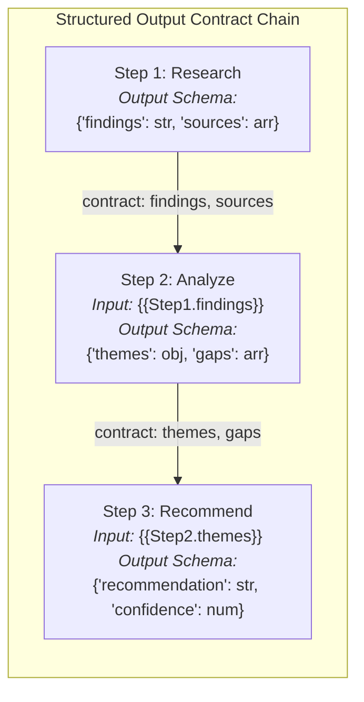

### 3.2 Pre/Post Processing as Deterministic Guards

Each pipeline step supports optional `pre_process` and `post_process` JavaScript functions that run before and after the LLM call. These are deterministic — they do not depend on model behavior.

**Pre-processing** transforms inputs before the LLM sees them. A common pattern is splitting an array into individual items for iteration:

```javascript
// pre_process: split a comma-separated list into individual items
function process(input) {
    return input.split(',').map(item => item.trim());
}
// Engine will iterate over each item, calling the LLM once per item
```

**Post-processing** validates and transforms outputs after the LLM produces them:

```javascript
// post_process: enforce date format and strip markdown
function process(output) {
    const data = JSON.parse(output);
    data.date = new Date(data.date).toISOString().split('T')[0];
    data.summary = data.summary.replace(/^#+\s*/gm, '');
    return JSON.stringify(data);
}
```

These guards ensure consistency regardless of model variability. Even if Claude occasionally wraps dates in different formats or adds unexpected markdown, the post-processor normalizes the output before it reaches the next step.

### 3.3 Conditional Branching as Explicit Edge-Case Handling

If steps use Claude's forced `tool_use` with an `evaluate_condition` tool that returns a boolean decision with reasoning:

```python
# evaluate_condition tool schema (from anthropic_provider.py)
{
    "name": "evaluate_condition",
    "description": "Evaluate if the given condition or question is true.",
    "input_schema": {
        "type": "object",
        "properties": {
            "result": {"type": "boolean"},
            "reasoning": {"type": "string"}
        },
        "required": ["result", "reasoning"]
    }
}
```

The engine routes execution to `next_steps_true` or `next_steps_false` based on the boolean result. This replaces the common single-agent pattern of "handle edge cases in your response" with explicit flow control:

**Single agent approach:**
> "Analyze the data. If the data is insufficient, ask for more context and include that in your analysis. If the data is sufficient, proceed with the full analysis."

**Pipeline approach:**
> Step 1: Analyze. Step 2: If `{{Analysis.confidence}} > 0.7` → Step 3 (Full Report). Else → Step 4 (Request More Data) → loop back to Step 1.

The pipeline approach makes the branching logic visible, testable, and auditable. The `reasoning` field on every If evaluation provides a logged justification for why the branch was taken.

---

## 4. Resilience and Reliability

### 4.1 Per-Step Retry with Exponential Backoff

When a step in a pipeline fails, only that step needs to retry — not the entire pipeline. All previously completed steps retain their outputs. CLAIRE implements per-step retry with exponential backoff:

```python
# Retry logic (from pipeline_engine.py)
max_retries = step.get("max_retries", 0) if step.get("retry_enabled") else 0
attempt = 0

while True:
    try:
        output = await _execute_step(pipeline_run, step, tool, sem)
        step["status"] = PipelineStatusType.Completed
        break
    except Exception as e:
        attempt += 1
        if attempt <= max_retries:
            await asyncio.sleep(2 * attempt)  # 2s, 4s, 6s...
            broadcast("step_retry", {"error": str(e), "attempt": attempt})
            continue
        else:
            step["status"] = PipelineStatusType.Failed
            break
```

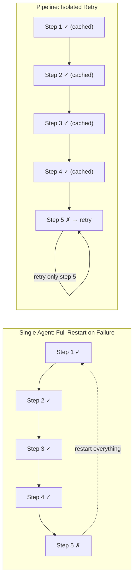

The `build_rerun()` function enables re-running from any specific step, preserving all earlier results. In a 10-step pipeline, failure at step 8 wastes only step 8's tokens — not the tokens from steps 1-7.

### 4.2 Concurrency Control

Parallel branches execute concurrently via `asyncio.gather()`, bounded by a semaphore:

```python
MAX_CONCURRENCY = 5
sem = asyncio.Semaphore(MAX_CONCURRENCY)

# When a step has multiple next_steps, fan out
parallel_tasks = [
    _run_single_step(step_id, pipeline_run, visited, queue, sem)
    for step_id in next_step_ids
]
await asyncio.gather(*parallel_tasks, return_exceptions=True)
```

Wait steps implement synchronization barriers: before executing a Wait step, the engine checks that ALL incoming branches have completed. If not, the Wait step is re-queued until its predecessors finish.

### 4.3 Loop Control

LoopCounter steps enforce bounded iteration with `max_passes`. When the count exceeds the maximum, the `_loop_halted` flag stops the loop:

```python
if tool_type == ToolType.LoopCounter:
    step["_loop_count"] = step.get("_loop_count", 0) + 1
    max_passes = tool.get("max_passes", 5)
    if step["_loop_count"] > max_passes:
        step["_loop_halted"] = True  # Branch terminates
```

After each loop iteration, `_clear_loop_visited()` resets downstream step states for re-execution, while the loop counter itself tracks the iteration count. This prevents infinite loops — something impossible to guarantee with a single agentic loop where the model decides when to stop.

### 4.4 Cost Tracking and Observability

Every LLM call within a pipeline step records token usage:

```python
step["call_cost"].append({
    "model": "claude-sonnet-4-20250514",
    "input_token_count": 1500,
    "output_token_count": 800,
    # Computed from model pricing config:
    # "input_cost": 0.00045, "output_cost": 0.0012, "total_cost": 0.00165
})
```

The pipeline run's `total_cost` aggregates across all steps. Real-time SSE events broadcast step-by-step progress to the frontend: `step_start`, `step_stream` (delta text), `step_complete`, `step_error`, `step_retry`. This observability enables teams to identify expensive steps and optimize — for instance, downgrading a classification step from Sonnet to Haiku when it's consuming 40% of the pipeline cost for a simple yes/no decision.

---

## 5. The Interconnectivity Advantage

This is the core thesis: multiple interconnected, specialized agents outperform a single monolithic agent.

### 5.1 Composability Through Nested Pipelines

CLAIRE supports `ToolType.Pipeline` steps that invoke nested pipelines recursively. A pipeline step creates a sub-run with its own step graph, input resolution, and output collection:

```python
# Nested pipeline execution (from pipeline_engine.py)
elif tool_type == ToolType.Pipeline:
    nested_pipeline = get_by_id("pipelines", tool["pipeline_id"])
    sub_run = {
        "id": get_uid(),
        "pipeline_id": nested_pipeline["id"],
        "pipeline_snapshot": nested_pipeline,
        "steps": nested_pipeline["steps"],
        "inputs": step["inputs"],  # Parent passes inputs to child
    }
    upsert("pipeline_runs", sub_run)
    await run_pipeline(sub_run["id"])  # Recursive execution
```

This enables **pipeline-as-component** design. Build a "data extraction" pipeline once, then reuse it inside "report generation," "email digest," and "compliance audit" pipelines. Each nested pipeline executes with full isolation — its own step graph, memory, cost tracking — while its outputs flow back to the parent via template variables.

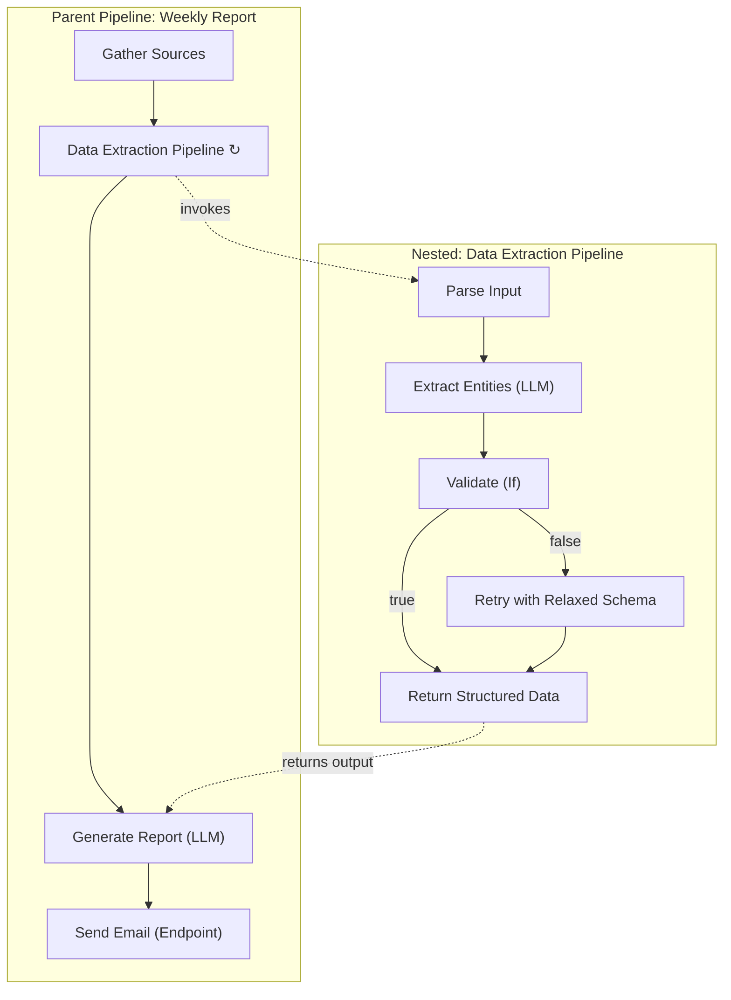

### 5.2 Task Steps: AI-Planned Sub-Orchestration

Task steps (`ToolType.Task`) implement a hybrid model: the outer pipeline provides deterministic orchestration, while Task steps provide AI-planned flexibility where the exact sequence of operations cannot be predetermined.

A Task step uses a two-phase approach:

**Phase 1 — Planning:** Claude receives the task description and a catalog of available tools, then generates a multi-step execution plan:

```json
{
    "goal": "Research competitor pricing and generate comparison",
    "steps": [
        {"type": "tool", "tool_id": "web-search-agent", "instructions": "Search for..."},
        {"type": "reasoning", "instructions": "Analyze the search results..."},
        {"type": "tool", "tool_id": "pricing-api", "instructions": "Fetch current pricing..."},
        {"type": "reasoning", "instructions": "Compare and synthesize findings..."}
    ]
}
```

**Phase 2 — Execution:** Steps execute sequentially, with each step's output becoming context for subsequent steps.

The key insight is that the outer pipeline's deterministic structure contains the Task step's AI flexibility. The Task step has bounded autonomy — it can plan and execute freely within its step, but its output must conform to the pipeline's data flow and structured output contracts.

### 5.3 Bounded Autonomy: Agent Steps Within Pipelines

Agent steps within pipelines run the full agentic loop — Claude calling Python functions and MCP servers over multiple iterations — but within the pipeline's structural constraints.

The agent's output is captured and made available via template variables to downstream steps. If the agent's tool has a `response_structure`, a post-hoc formatting call re-processes the agent's raw output through forced `tool_use`:

```python
# Agent output post-formatting (from pipeline_engine.py)
if response_structure and agent_raw_output:
    schema = _build_json_schema(response_structure)
    struct_tool = {
        "name": "structured_output",
        "description": "Format the agent's response into the required structure.",
        "input_schema": schema,
    }
    format_msg = [{"role": "user",
        "content": f"Format the following data into the required structure:\n\n{agent_raw_output}"}]
    result = await chat_with_tools(
        format_msg, [struct_tool], model, "",
        tool_choice={"type": "tool", "name": "structured_output"},
    )
```

This is **bounded autonomy**: the agent has full freedom to research, explore, and reason within its step, but its output is structured and its position in the workflow is fixed. Downstream steps receive guaranteed-shape data regardless of which tool-call sequence the agent chose.

### 5.4 Triggers: Event-Driven Interconnectivity

CLAIRE's trigger system connects external events to pipeline execution without human initiation:

```python
class TriggerType(IntEnum):
    Cron        = 0  # Time-based (e.g., "0 9 * * MON" = every Monday at 9am)
    FileWatcher = 1  # Directory monitoring (created/modified/deleted events)
    Webhook     = 2  # HTTP POST endpoint for external system integration
    RSS         = 3  # Feed polling (fires on new entries only)
    Custom      = 4  # Long-lived Python subprocess with emit() callback
```

Each trigger has a `connections` array that maps trigger outputs to pipeline inputs via template expressions:

```json
{
    "connections": [
        {
            "pipeline_id": "report-pipeline-123",
            "is_enabled": true,
            "input_mappings": [
                {"pipeline_input": "ArticleTitle", "expression": "{{ entry_title }}"},
                {"pipeline_input": "ArticleURL", "expression": "{{ entry_link }}"},
                {"pipeline_input": "FeedSource", "expression": "{{ feed_url }}"}
            ]
        }
    ]
}
```

When the trigger fires, `fire_trigger()` resolves these template expressions against the trigger's output context and launches the connected pipeline asynchronously. This creates **reactive AI systems**: an RSS feed publishes a new article, the trigger detects it, the pipeline classifies relevance, extracts key points, drafts a summary, and posts to Slack — all without human initiation.

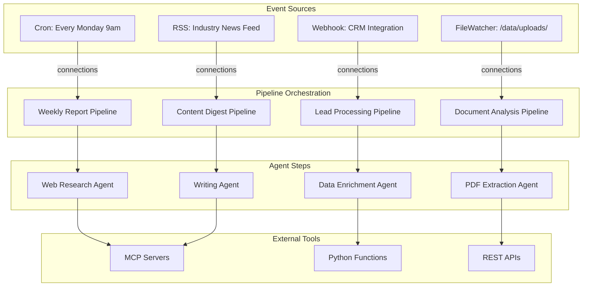

### 5.5 Memory as Selective Context Injection

Pipeline memory nodes solve the context window trap by providing **selective context injection**. Instead of dumping the entire conversation history into every step, memory nodes are connected to specific steps via `_memory` edges in the pipeline graph.

```python
# Memory injection (from pipeline_engine.py)
def _get_step_memories(pipeline_run, step_id):
    """Find all memory nodes connected to this step via _memory edges."""
    memories = []
    for edge in pipeline_run.get("edges", []):
        if edge["target"] == step_id and "_memory" in edge.get("source_handle", ""):
            memory_node = find_memory_by_id(edge["source"])
            if memory_node:
                memories.append(memory_node)
    return memories

def _build_memory_messages(memories):
    """Sort and flatten memory messages for LLM injection."""
    all_msgs = []
    for mem in memories:
        all_msgs.extend(mem.get("messages", []))
    return sorted(all_msgs, key=lambda m: m.get("timestamp", ""))
```

Two memory types serve different use cases:

- **Session memory**: persists only within the current run. Useful for multi-step conversations where later steps need to reference earlier step outputs as conversation context.
- **Long-term memory**: persists across runs in the `pipeline_memories` database table. Useful for building accumulated knowledge — e.g., a content pipeline that remembers previously covered topics to avoid repetition.

Each memory node has a `max_messages` setting that trims old messages, controlling context window usage per step. Step 3 might have 50 messages of customer history, while Step 7 has 10 messages of recent technical context. Neither step drowns in the other's noise.

---

## 6. Practical Patterns

### 6.1 Pattern: Research-Analyze-Synthesize

This pattern decomposes a complex research task into specialized stages with validation gates.

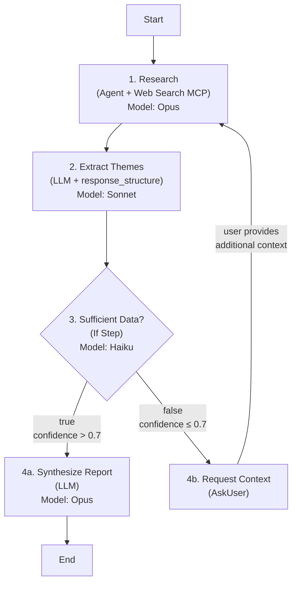

**Why this outperforms a single agent:**
- **Step 1** gets a focused Agent with web search tools, using Opus for complex reasoning
- **Step 2** enforces a structured output contract: `{themes: [{name, evidence, confidence}]}` — guaranteed shape
- **Step 3** explicitly handles the edge case of insufficient data, rather than hoping the model produces a qualified response
- **Step 4b** pauses the pipeline and asks the user for more context — a capability impossible in a single synchronous agent call
- Retry at any step does not lose prior work. If the synthesis step fails, research results are cached.

### 6.2 Pattern: Parallel Multi-Perspective Analysis

This pattern uses parallel branches to reduce latency and enforce diverse viewpoints.

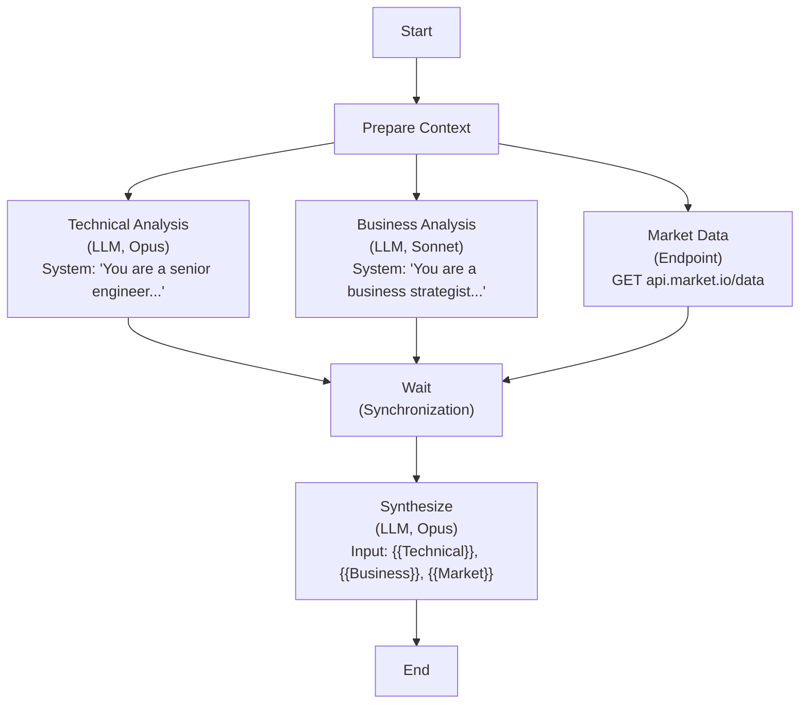

**Why this outperforms a single agent:**
- **Parallel execution** reduces wall-clock time — three branches run concurrently (bounded by MAX_CONCURRENCY=5 semaphore)
- **Each perspective gets a focused prompt** and system instruction. The technical analyst does not need to "also consider business implications" in the same call.
- **The synthesis step receives pre-structured inputs** via template variables rather than hoping the LLM considers all angles in a single pass
- **The Endpoint step** fetches real data from an API — no hallucination risk for market figures
- **The Wait step** guarantees all branches complete before synthesis begins

### 6.3 Pattern: Event-Driven Content Pipeline

This pattern creates an autonomous content processing system triggered by external events.

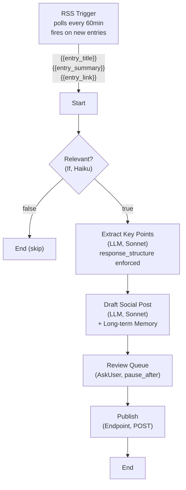

**Why this outperforms a single agent:**
- **The trigger** makes it autonomous — no human initiates the process
- **The If step** filters irrelevant content without wasting tokens on full processing
- **Structured extraction** creates reusable data (not buried in narrative text)
- **Long-term memory** on the drafting step accumulates topic context across runs, producing increasingly informed and non-repetitive content
- **The AskUser step** keeps a human in the loop for final approval before publishing
- **The Endpoint step** posts to the actual platform API — deterministic, no hallucination

---

## 7. Quantifying the Difference

### 7.1 Consistency Metrics

| Metric | Single LLM Call | Single Agent Loop | Pipeline |
|--------|----------------|-------------------|----------|
| **Schema conformance rate** | 70-90% (varies by prompt complexity) | 60-85% (agent output is conversational) | ~100% (forced tool_use per step) |
| **Field-level reliability** | 8/10 fields consistently present | Variable (depends on loop trajectory) | 10/10 by construction |
| **Cross-run output variance** | High (format, length, structure vary) | Very high (different tool-call paths) | Low (deterministic data flow + schemas) |
| **Edge case handling** | Implicit (prompt must anticipate all cases) | Implicit (model decides at runtime) | Explicit (If steps with logged reasoning) |

Schema conformance rate measures the percentage of runs where output matches the expected structure. With `response_structure` enforcement via forced `tool_use`, pipeline steps approach 100% conformance. Single-agent free-text responses, even with detailed format instructions, achieve 70-90% depending on prompt complexity — and the failures are often subtle (missing optional fields, inconsistent nesting, extra narrative text wrapping the JSON).

### 7.2 Cost Efficiency

**Per-step model selection** is the most direct cost lever. Consider a 5-step pipeline:

| Step | Model (Single Agent) | Cost | Model (Pipeline) | Cost |
|------|---------------------|------|-------------------|------|
| Research | Opus | $0.02 | Opus | $0.02 |
| Classify | Opus | $0.005 | Haiku | $0.0002 |
| Extract | Opus | $0.01 | Sonnet | $0.004 |
| Synthesize | Opus | $0.015 | Opus | $0.015 |
| Format | Opus | $0.005 | Haiku | $0.0002 |
| **Total** | | **$0.055** | | **$0.0394** |

That is a 28% cost reduction by right-sizing models. At scale — thousands of runs per day — this compounds significantly.

**Failure cost** compounds the advantage. If a single agent fails at 80% completion, all tokens are wasted. A pipeline failure at step 4/5 wastes only step 4's tokens — steps 1-3 are cached.

### 7.3 Reliability Metrics

| Metric | Single Agent | Pipeline |
|--------|-------------|----------|
| **Recovery from transient failure** | Full restart | Per-step retry (2s, 4s, 6s backoff) |
| **Mean time to recovery** | Minutes (requires human restart) | Seconds (automatic retry) |
| **Audit trail** | Conversation log (implicit) | Per-step: prompt_used, call_cost, status, outputs |
| **Cost predictability** | Low (agent may use 2-28 iterations) | High (fixed step count, known models) |
| **Reusability** | Copy-paste prompts | Nested pipelines as reusable components |

---

## 8. Architecture Deep Dive

### 8.1 Execution Engine

The pipeline engine implements BFS traversal of a step DAG with several key mechanisms:

- **Visited set**: Prevents re-execution of steps (except in explicit LoopCounter constructs where `_clear_loop_visited()` resets downstream states)
- **Semaphore concurrency**: `asyncio.Semaphore(5)` limits concurrent step execution
- **Stop commands**: An in-memory `stop_commands: set[str]` allows graceful cancellation via `POST /api/pipelines/runs/{run_id}/stop`
- **Pause/Resume**: Steps with `pause_after=true` pause the pipeline after completion, allowing human review or output editing before continuation
- **Execution history**: Before re-running a step, its prior execution is snapshotted to `step["execution_history"]`, preserving audit trails

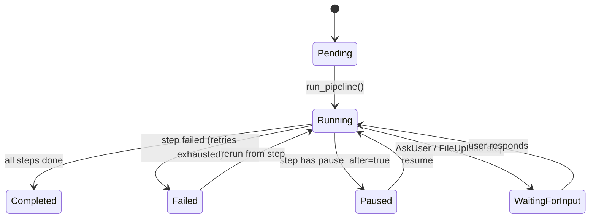

### 8.2 Template Resolution Pipeline

The resolution chain in `_prep_step()` processes templates in priority order:

```
1. Step inputs         → {{InputName}} from step configuration
2. Previous outputs    → {{PrevStepName}} from completed step outputs
3. Action params       → {{AgentStep_action}} from agent tool summaries
4. Pipeline inputs     → {{PipelineInput}} from user-provided run inputs
5. Pipeline outputs    → {{PipelineOutput}} from accumulated results
```

The regex pattern `\{\{(\s*[\w\d_\[\]@\.\- ]+\s*)\}\}` supports:

| Syntax | Example | Behavior |
|--------|---------|----------|
| Simple | `{{StepName}}` | Full output of named step |
| Dot path | `{{Step.field.nested}}` | JSON navigation into structured output |
| Array index | `{{Step[0]}}` | First element of array output |
| Relative index | `{{Step[@]}}` | Current iteration index (for split processing) |
| Negative index | `{{Step[-1]}}` | Last element of array output |

For JSON contexts (endpoint bodies, headers), `parse_json()` applies JSON-safe escaping to replacement values, preventing injection of invalid JSON.

### 8.3 Structured Output Enforcement

The `_build_json_schema()` function recursively converts a `response_structure` field tree into a JSON Schema:

```
ResponseField{key: "analysis", type: "object", children: [
    ResponseField{key: "score", type: "number"},
    ResponseField{key: "summary", type: "string"}
]}
```

Becomes:

```json
{
    "type": "object",
    "properties": {
        "analysis": {
            "type": "object",
            "properties": {
                "score": {"type": "number"},
                "summary": {"type": "string"}
            },
            "required": ["score", "summary"]
        }
    },
    "required": ["analysis"]
}
```

This schema is passed to Claude's API as a tool definition with `tool_choice: {"type": "tool", "name": "structured_output"}`, which forces the model to respond using that tool — and therefore conforming to the schema. The enforcement happens at the API level, not the prompt level.

For Agent steps, a separate post-formatting call re-processes the agent's raw conversational output through the same schema. This means an agent can reason freely during its agentic loop, but its final output to the pipeline is always structured.

### 8.4 Memory Architecture

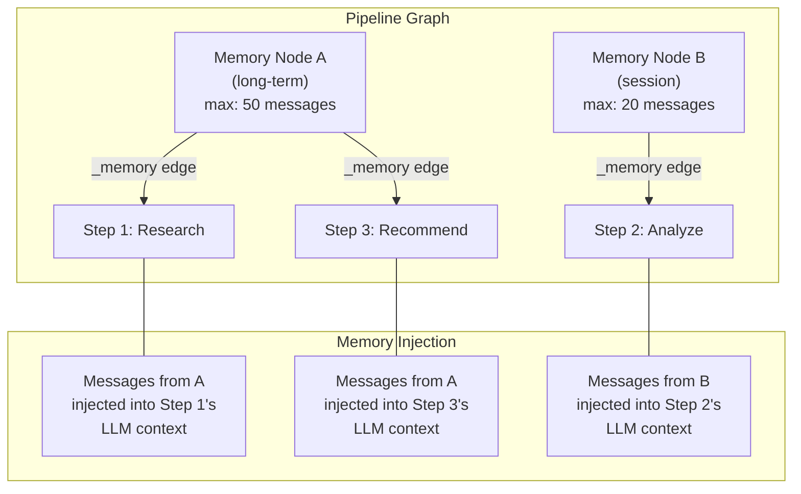

Memory nodes connect to steps via edges with `_memory` source handles. The engine resolves connections at runtime:

- **Session memories** exist only for the current run. After each step execution, the step's input/output pair is appended to connected session memories. Useful for building conversation context within a single pipeline execution.
- **Long-term memories** are loaded from the `pipeline_memories` database table at run start and saved back at run end. They accumulate across runs, enabling pipelines that learn from previous executions. A `max_messages` cap prevents unbounded growth.

---

## 9. When NOT to Use Pipelines

Intellectual honesty demands acknowledging where pipelines add overhead without proportional benefit.

### 9.1 When Single Agents Win

**Simple, well-defined tasks.** "Translate this paragraph to French." "Summarize this email." These are one-step tasks where designing a DAG adds complexity for zero benefit. A single LLM call with a clear prompt is the right tool.

**Exploratory, open-ended tasks.** "Investigate this bug and fix it." "Research this topic and tell me what's interesting." When the path is genuinely unknown, agent autonomy is a feature, not a limitation. The nondeterminism that makes agents unreliable for production pipelines makes them excellent for exploration.

**Rapid prototyping.** Iterating on a single prompt is faster than designing a multi-step pipeline. Start with a single agent, identify which sub-tasks need consistency enforcement, then graduate to a pipeline.

### 9.2 Pipeline Overhead

**Design complexity.** A 15-step pipeline with conditional branching, parallel paths, and loop counters requires thoughtful architecture. A poorly designed pipeline — one that over-decomposes simple tasks or creates unnecessary dependencies — can be worse than a good single agent.

**Sequential latency.** A 5-step sequential pipeline has roughly 5x the latency of a single call (mitigated by parallel branches where independent steps run concurrently). For real-time interactive use cases, this matters.

**Over-engineering.** Not every task needs conditional branching, retry logic, and memory nodes. The right threshold for pipeline adoption is when output consistency matters, task complexity is high, or the workflow runs repeatedly at scale. For one-off tasks, a single agent is fine.

---

## 10. Conclusion

Two arguments underpin this whitepaper:

**Consistency is an engineering problem, not a prompting problem.** You cannot prompt-engineer your way to reliable, production-grade output from a single LLM call. Format drift, hallucination compounding, and edge-case handling are structural problems that require structural solutions. Pipelines solve them through structured output contracts at step boundaries, deterministic data flow via template variables, and explicit conditional branching with auditable reasoning. The result is output that conforms to expectations not 80% of the time, but approaching 100%.

**Interconnected specialized agents outperform monolithic agents.** A single agent with a long prompt is a generalist — adequate at everything, excellent at nothing. A pipeline of specialized steps is a team — each step focused on one sub-task with the right model, the right prompt, the right output schema. Specialization reduces per-step complexity. Explicit data flow removes implicit dependencies. Parallel execution reduces latency. Failure isolation reduces blast radius. Memory nodes provide selective context instead of context overload.

CLAIRE's pipeline engine implements these principles through a DAG execution engine with 15 step types, a template variable system for deterministic data flow, forced `tool_use` for structured output contracts, per-step retry with exponential backoff, bounded parallel execution, event-driven triggers, nested pipeline composition, and selective memory injection. Together, these capabilities transform AI from a probabilistic tool into a reliable engineering component.

**A single agent is a prototype. A pipeline is a product.**

---

## Appendix A: Step Type Reference

| Type | ID | Description | Key Configuration |
|------|----|-------------|-------------------|
| **LLM** | 0 | Claude processes a prompt and returns text or structured JSON | `prompt`, `system_prompt`, `model`, `response_structure` |
| **Endpoint** | 1 | HTTP API call (GET/POST/PUT/DELETE) | `endpoint_url`, `endpoint_method`, `endpoint_headers`, `endpoint_body` |
| **Pause** | 2 | Pauses pipeline execution for human review | — |
| **Agent** | 3 | Multi-turn agentic loop with Python functions and MCP servers | `prompt`, `model`, `agent_functions`, `mcp_servers`, `pip_dependencies` |
| **Pipeline** | 4 | Invokes a nested pipeline as a sub-run | `pipeline_id` |
| **If** | 5 | Conditional branching based on LLM boolean evaluation | `prompt`, `next_steps_true`, `next_steps_false` |
| **Parallel** | 6 | Pass-through step for explicit fan-out | `next_steps` (multiple) |
| **End** | 7 | Terminal step marking a pipeline exit point | — |
| **Wait** | 8 | Synchronization barrier — waits for all incoming branches | — |
| **Start** | 9 | Entry point for pipeline execution | — |
| **LoopCounter** | 10 | Bounded iteration with configurable maximum | `max_passes` |
| **AskUser** | 11 | Multi-round conversation pausing for user input | `prompt`, `system_prompt` |
| **FileUpload** | 12 | Pauses pipeline to accept file uploads from user | `prompt` |
| **FileDownload** | 13 | Provides files for user download | — |
| **Task** | 14 | AI-planned multi-step sub-orchestration | `prompt`, `model` |

## Appendix B: Template Variable Syntax

| Syntax | Example | Description |
|--------|---------|-------------|
| `{{Name}}` | `{{ResearchStep}}` | Full text output of the named step |
| `{{Name.field}}` | `{{Analysis.score}}` | Dot-path into JSON output (auto-parsed) |
| `{{Name.a.b}}` | `{{Data.results.count}}` | Nested dot-path navigation |
| `{{Name[N]}}` | `{{Items[0]}}` | Array index (zero-based) |
| `{{Name[@]}}` | `{{Items[@]}}` | Relative index (current iteration) |
| `{{Name[-1]}}` | `{{Items[-1]}}` | Negative index (last element) |

**Resolution priority:** Step inputs → Previous step outputs → Action params → Pipeline inputs → Pipeline outputs

**JSON safety:** Use `parse_json()` for values embedded in JSON strings (endpoint bodies, headers). Values are automatically escaped to prevent JSON injection.

## Appendix C: Response Structure Examples

### Flat Schema

```json
[
    {"key": "summary", "type": "string"},
    {"key": "sentiment", "type": "string"},
    {"key": "confidence", "type": "number"}
]
```

### Nested Schema

```json
[
    {"key": "analysis", "type": "object", "children": [
        {"key": "score", "type": "number"},
        {"key": "reasoning", "type": "string"},
        {"key": "factors", "type": "object", "children": [
            {"key": "positive", "type": "string"},
            {"key": "negative", "type": "string"}
        ]}
    ]},
    {"key": "recommendation", "type": "string"},
    {"key": "next_steps", "type": "string"}
]
```

### Agent Post-Formatting Schema

When applied to an Agent step, the `response_structure` does not constrain the agent during its agentic loop — the agent reasons and calls tools freely. After the loop completes, a separate formatting call re-processes the agent's raw output through this schema, producing consistent structured data for downstream steps.

```json
[
    {"key": "findings", "type": "object", "children": [
        {"key": "data_points", "type": "string"},
        {"key": "sources", "type": "string"},
        {"key": "confidence", "type": "number"}
    ]},
    {"key": "raw_notes", "type": "string"}
]
```
