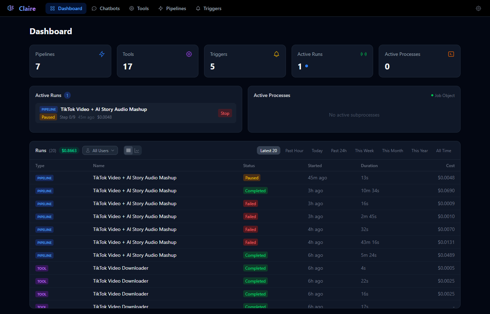
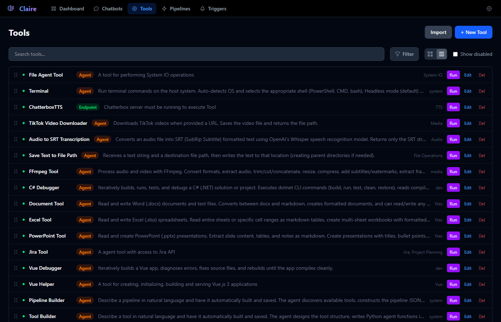
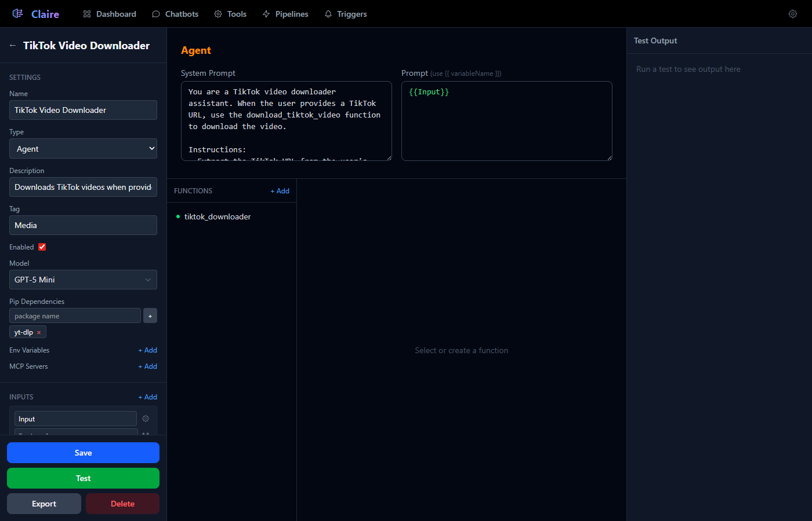
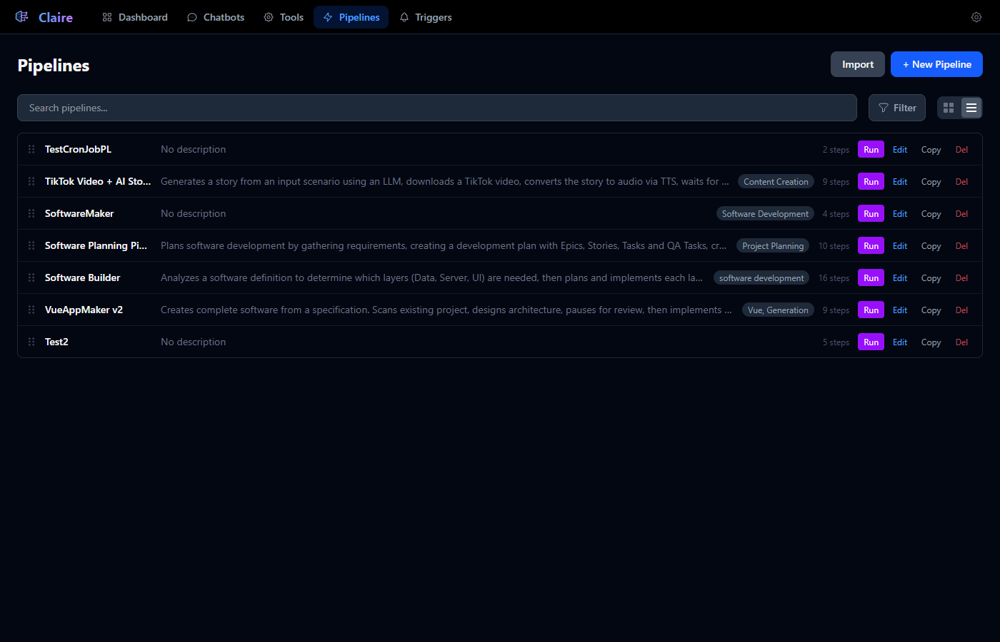
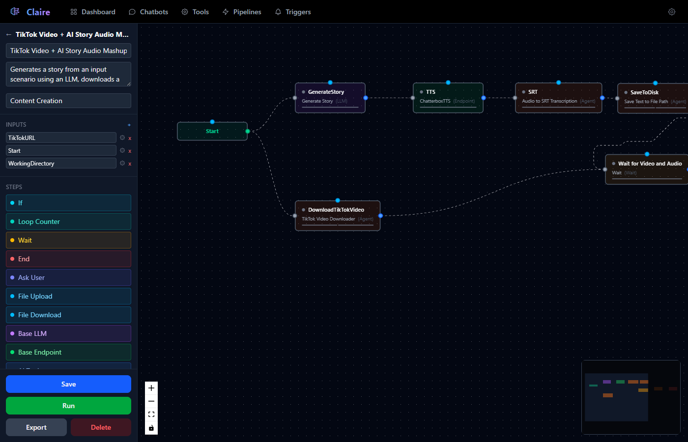
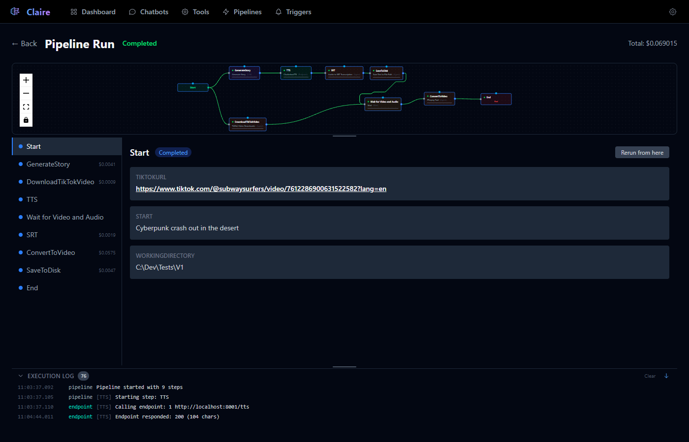
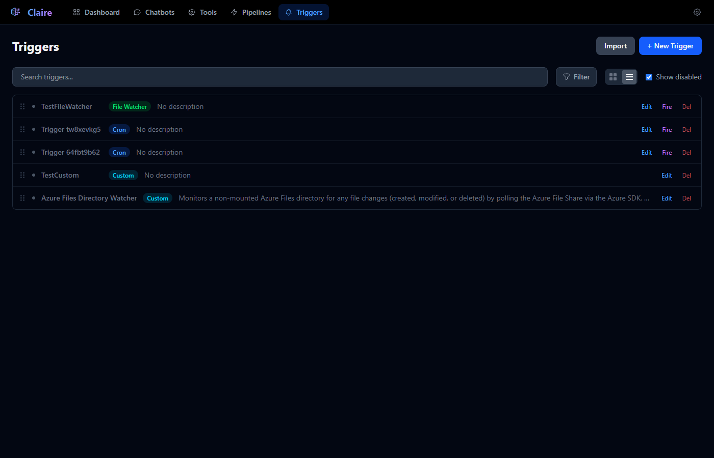
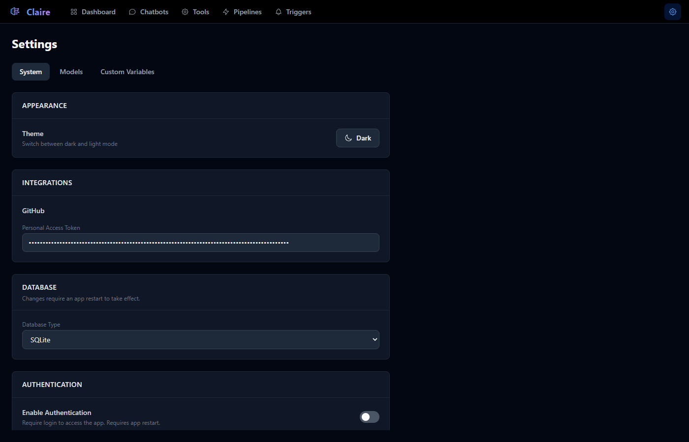

# Claire - AI Orchestration Platform

Claire is a full-stack AI orchestration platform for building, connecting, and automating AI-powered workflows. Create tools, chain them into pipelines, and trigger automations — all from a single interface.



## Features at a Glance

- **Tools** — Build reusable AI-powered units of work (LLM prompts, API endpoints, autonomous agents)
- **Pipelines** — Visually connect tools into multi-step workflows with a node-based editor
- **Triggers** — Automate pipeline execution with cron schedules, file watchers, webhooks, RSS feeds, or custom scripts
- **Dashboard** — Monitor runs, costs, active processes, and trigger activity in real time
- **Authentication** — Optional multi-user auth with roles, permissions, and OAuth (Google, Microsoft)

## Tech Stack

| Layer | Technology |
|-------|-----------|
| **Frontend** | Vue 3, TypeScript, Tailwind CSS v4, Vue Flow |
| **Backend** | Python, FastAPI, Uvicorn |
| **AI** | Anthropic Claude SDK, OpenAI SDK, Google Gemini SDK, xAI Grok, Local LLMs (OpenAI-compatible) |
| **Embeddings** | Sentence Transformers (BAAI/bge-large-en-v1.5) |
| **Vector Store** | FAISS |
| **Database** | SQLite (default), MSSQL, PostgreSQL, Azure Cosmos DB |
| **Protocols** | MCP (Model Context Protocol), WebSocket, SSE |

---

## Tools

Tools are the building blocks of Claire. Each tool is a self-contained unit of work that can be run standalone or composed into pipelines.



### Tool Types

- **LLM** — Send a prompt to Claude, GPT, Gemini, Grok, or a local model and get a response. Supports system prompts, template variables (`{{Input}}`), and structured JSON output.
- **Endpoint** — Make HTTP requests (GET, POST, PUT, DELETE) to external APIs with configurable headers, query parameters, and body templates.
- **Agent** — Autonomous agents that write and execute Python functions in a loop. The LLM decides which functions to call and iterates until the task is complete. Agents support pip dependencies, scoped environment variables, and MCP server integrations.

### Tool Editor



Key capabilities:
- **Template variables** — Use `{{VariableName}}` in prompts and configurations to create reusable, parameterized tools
- **Structured output** — Define a JSON response schema and the LLM will return structured data matching your specification
- **Agent functions** — Write Python functions that the agent can call. Functions are introspected and exposed to the LLM as callable tools
- **Pip dependencies** — Declare Python packages; they are auto-installed when the tool is saved
- **MCP servers** — Connect to Model Context Protocol servers (stdio or HTTP) to extend agent capabilities with external tools
- **Environment variables** — Scope secrets and configuration per tool
- **AI Assist** — Describe a tool in natural language and have it built automatically
- **Import / Export** — Share tools as JSON files
- **Test panel** — Run the tool directly from the editor and see streaming output

---

## Pipelines

Pipelines connect tools into multi-step workflows using a visual node-based editor. Steps execute in sequence or in parallel based on the graph you design.



### Pipeline Editor



The visual editor provides:
- **Drag-and-drop canvas** — Position nodes freely with zoom, pan, and minimap
- **Node types** — Start, LLM, Endpoint, Agent, If (conditional branching), Wait, Ask User, File Upload, File Download, End
- **Edge connections** — Draw connections between nodes to define execution flow
- **Pipeline inputs** — Define typed input parameters that are prompted when the pipeline runs
- **Template variables** — Reference inputs and step outputs using `{{StepName}}` syntax across any step
- **Pre/post-process hooks** — Write JavaScript to transform data between steps
- **Conditional branching** — If nodes evaluate conditions and route to different paths
- **Pause & resume** — Steps can pause for user input or file uploads, then continue
- **Memory nodes** — Persistent storage that survives across pipeline runs
- **Retry logic** — Configure per-step retry on failure
- **AI Assist** — Describe a pipeline in natural language and have it generated
- **Import / Export / Copy** — Share pipelines as JSON or duplicate them

### Pipeline Runs



When a pipeline executes, you get a live view showing:
- **Visual flow** with color-coded step status (pending, running, completed, failed)
- **Step-by-step output** — Click any step to see its inputs, outputs, and cost
- **Execution log** — Timestamped log entries streamed in real time
- **Cost tracking** — Per-step and total cost based on token usage and model pricing
- **Interactive controls** — Stop a run, rerun from any step, or edit step output while paused
- **User interaction** — Respond to "Ask User" prompts or upload files when a step is waiting

---

## Triggers

Triggers automate pipeline execution in response to events. When a trigger fires, it runs connected pipelines with mapped input parameters.



### Trigger Types

| Type | Description |
|------|-------------|
| **Cron** | Schedule execution using standard 5-field cron syntax (e.g., `0 9 * * MON-FRI`) |
| **File Watcher** | Monitor a directory for file changes (created, modified, deleted) with pattern matching |
| **Webhook** | Receive HTTP POST requests at an auto-generated URL — connect external services |
| **RSS** | Poll an RSS feed and fire when new items appear |
| **Custom** | Write a long-running Python script that emits events programmatically |

### Trigger Features

- **Pipeline connections** — Link one trigger to multiple pipelines with input mappings
- **Output variables** — Define outputs that map to pipeline inputs via template expressions
- **Custom code** — Write Python handler functions with access to scoped environment variables
- **AI Assist** — Describe a trigger in natural language and have it built
- **Manual fire** — Test any trigger by firing it manually from the UI
- **Import / Export** — Share trigger configurations as JSON

---

## Dashboard

The dashboard provides a real-time operations view across all of Claire's systems.


- **Stat cards** — Counts of pipelines, tools, triggers, active runs, and active triggers
- **Active runs** — Currently executing pipelines with step progress, duration, cost, and stop controls
- **Active processes** — Subprocess registry with PIDs and kill controls (admin)
- **Active triggers** — Enabled triggers with fire counts and last status
- **Recent runs table** — Filterable history (past hour, today, this week, etc.) with type, status, duration, and cost
- **Chart view** — Toggle to a visual chart of run performance metrics
- **User filter** — Admins can filter the dashboard by specific user
- **Cost aggregation** — Total cost across all visible runs

---

## Settings



### System Settings (Admin)

- **Appearance** — Dark / light theme toggle
- **Integrations** — GitHub Personal Access Token for repository access
- **Database** — Switch between SQLite, MSSQL, PostgreSQL, or Azure Cosmos DB
- **Authentication** — Enable/disable login, configure OAuth providers (Google, Microsoft)

### Model Management

- **API Keys** — Configure Anthropic, OpenAI, Google, xAI API keys, and local LLM server URLs
- **Default model** — Set the default LLM for new tools and pipelines
- **Model registry** — Add, edit, or remove models with custom pricing (input/output cost per million tokens)
- Built-in support for Claude (Opus 4.6, Sonnet 4.6, Haiku 4.5), OpenAI (GPT-5.2, GPT-5.1, GPT-5 Mini/Nano), Google Gemini (2.5 Pro, 2.5 Flash), xAI Grok (Grok 3, Grok 3 Mini), and local models via any OpenAI-compatible server (Ollama, vLLM, LM Studio, llama.cpp)

### Custom Variables

- Per-resource environment variable management
- Scoped secrets that are injected into tool and trigger execution contexts
- Password field support for sensitive values

---

## Authentication & Authorization

Claire supports optional multi-user authentication with granular permissions.

### Roles

| Role | Capabilities |
|------|-------------|
| **Owner** | Full system control. Creates admins. Only one per instance. |
| **Admin** | User management, system settings, access to all resources |
| **User** | Access scoped by per-user permissions and resource grants |

### Features

- **JWT authentication** with configurable secret
- **OAuth login** — Google and Microsoft SSO
- **Per-user permissions** — Granular create/edit/delete rights per resource type (tools, pipelines, triggers)
- **Resource access grants** — Control which specific resources each user can see and use
- **Password management** — Admin password reset, forced password change on next login
- **User management UI** — Create, edit, disable, and delete user accounts

---

## Getting Started

### Prerequisites

- Python 3.11+
- Node.js 20+
- An Anthropic API key

### Local Development

```bash
# Clone the repository
git clone <repo-url>
cd Clair-ai/

# Backend
cd backend
cp .env.example .env          # Add your API keys
pip install -r requirements.txt
python main.py                 # Starts on http://localhost:8000

# Frontend (separate terminal)
cd frontend
npm install
npm run dev                    # Starts on http://localhost:5173
```

The frontend dev server proxies `/api` and `/ws` requests to the backend.

### Production Build

```bash
cd frontend
npm run build                  # Outputs to frontend/dist/
```

The backend serves the built frontend automatically from `frontend/dist/` — no separate web server needed.

### Docker

```bash
docker build -t claire .
docker run -p 8000:8000 -v ./data:/app/data --env-file backend/.env claire
```

The Docker image builds the frontend, installs Python dependencies, and runs the combined application on port 8000. The `data/` volume persists the SQLite database, FAISS indexes, uploaded files, and agent code.

---

## Configuration

All configuration is managed via environment variables in `backend/.env`. See `backend/.env.example` for a full reference.

| Variable | Description |
|----------|-------------|
| `ANTHROPIC_API_KEY` | Anthropic API key (required for Claude models) |
| `OPENAI_API_KEY` | OpenAI API key (optional, for GPT models) |
| `GOOGLE_API_KEY` | Google API key (optional, for Gemini models) |
| `XAI_API_KEY` | xAI API key (optional, for Grok models) |
| `LOCAL_LLM_URL` | Local LLM server URL (optional, e.g. `http://localhost:11434/v1`) |
| `LOCAL_LLM_API_KEY` | Local LLM API key (optional, defaults to `local`) |
| `VOYAGE_API_KEY` | Voyage AI key (optional) |
| `DEFAULT_MODEL` | Default LLM model ID |
| `GITHUB_TOKEN` | GitHub PAT for repository indexing |
| `DB_TYPE` | `sqlite`, `mssql`, `postgres`, or `cosmos` |
| `AUTH_ENABLED` | `true` / `false` — enable multi-user auth |
| `JWT_SECRET` | Secret for signing JWT tokens |
| `GOOGLE_CLIENT_ID/SECRET` | Google OAuth credentials |
| `MICROSOFT_CLIENT_ID/SECRET` | Microsoft OAuth credentials |

---

## Project Structure

```
CLAIRE/
├── backend/                # FastAPI backend
│   ├── api/                # Route handlers (tools, chatbots, pipelines, triggers, auth, etc.)
│   ├── services/           # Business logic (agents, pipeline engine, RAG, triggers, etc.)
│   ├── models/             # Data models (Pydantic)
│   ├── db/                 # Database helpers
│   ├── data/               # Runtime data (SQLite DB, FAISS indexes, uploads, agent code)
│   └── main.py             # Application entry point
├── frontend/               # Vue 3 SPA
│   ├── src/
│   │   ├── views/          # Page components
│   │   ├── components/     # Reusable UI components
│   │   ├── composables/    # Vue composition functions
│   │   ├── services/       # API client services
│   │   └── router/         # Vue Router configuration
│   └── dist/               # Production build output
├── Docs/                   # Documentation and images
├── Dockerfile              # Multi-stage Docker build
└── README.md
```

---

## Documentation

Detailed documentation for each feature is available in the [Docs](Docs/) directory:

- [Tools](Docs/Tools/Tools.md) — Tool types, editor, functions, template variables, and agent execution
- [Pipelines](Docs/Pipelines/Pipelines.md) — Pipeline editor, step types, memory, parallel execution, and run viewer
- [Triggers](Docs/Triggers/Triggers.md) — Trigger types, configuration, and pipeline connections

---

## License

This project is proprietary software. All rights reserved.
